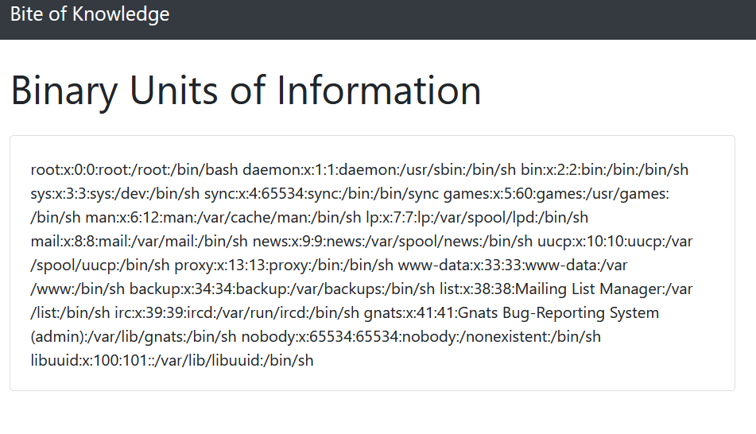

# Bite

## Problem

```
Want to learn about binary units of information? Check out the "Bite of Knowledge" website!

Connect here:
http://jh2i.com:50010
```

## Solution

Following the link takes us to a [page](images/bite1.PNG), which gives us information on bits and other data formats. Under the "References"
section, we can access links to other data formats like `Octet` and `Word`. In doing so, we find that a parameter `page`
is appended to the base URL.

If we check the source code of the page, this applies to all the data formats under the References section.


This means that we can try exploiting LFI. We try setting `/?page=../../etc/passwd` to see if `/etc/passwd` is returned,
but it returns an error instead:


The server adds a `.php` extension to the back of whatever we input to `page` parameter. [Searching online](images/bitemisc1.PNG) reveals that to 
bypass this, we just need to add a *null byte* (`%00` in Unicode) to the back of our `page`. This allows us to escape the 
additional `.php` extension.



Earlier, while we were playing around with the `page` parameter, we found that setting `page=flag` (ie. `flag.php`) gives
us a vital clue in locating the right LFI.


This tells us that the flag is located in the root directory in a file called `file.txt`. By navigating to `/index.php?page=/flag.txt%00` 
we get the flag.


**Flag**: `flag{lfi_just_needed_a_null_byte}`

&nbsp;

#### References:
* http://www.securityidiots.com/Web-Pentest/LFI/guide-to-lfi.html