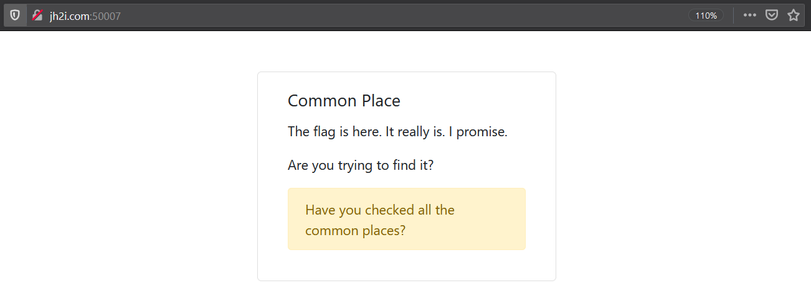
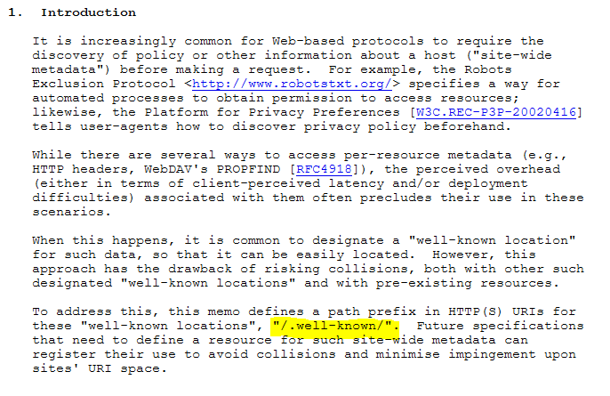
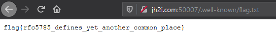

# Common Place

## Problem

```
asd7138: can you find the flag here?
tcm3137: no, i dont see it
jwh8163: i cant find it either
rfc5785: i found it
asd7138: what!? where?!
jwh8163: tell us!


Connect here:
http://jh2i.com:50007
```

## Solution

Accessing the link takes us to this landing page:



The challenge name suggests that we should look in "common places". We search for robots.txt and in cookies, but there is 
nothing there that contains the flag.

The challenge description was something that was nagging at me from the start. `rfc5785` found the flag, could it be referring
to a Request for Comment (RFC)? I googled "RFC 5785" online, and it talks about the existence of a directory named `/.well-known/`:



I tried [checking if such a folder exists](images/commonplace3.PNG) on the challenge domain. Sure enough, it leads us to a folder containing a `flag.txt`.
Opening it gives us the flag.



**Flag**: `flag{rfc5785_defines_yet_another_common_place}`

&nbsp;

#### References:
* https://tools.ietf.org/html/rfc5785