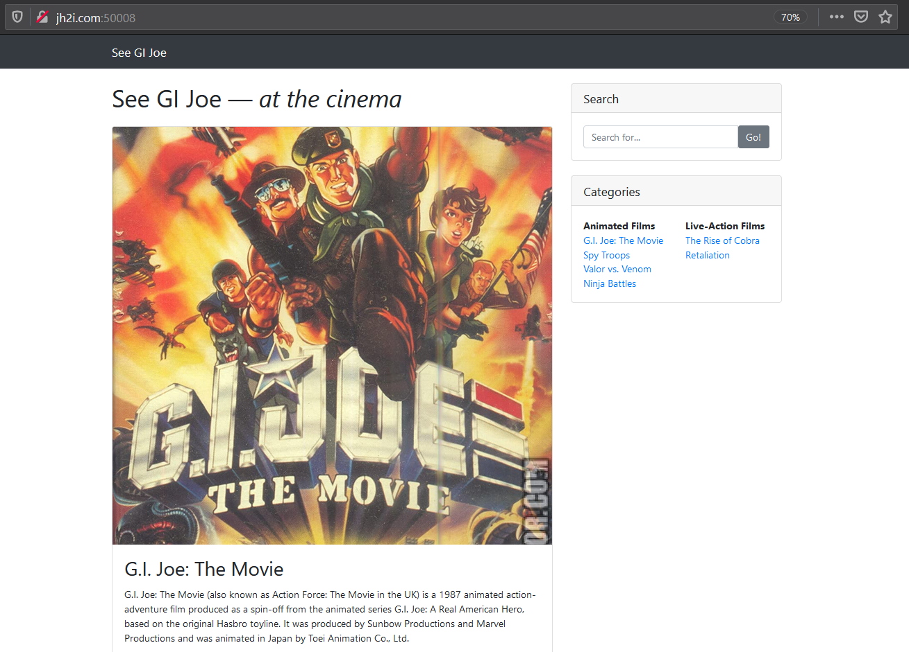
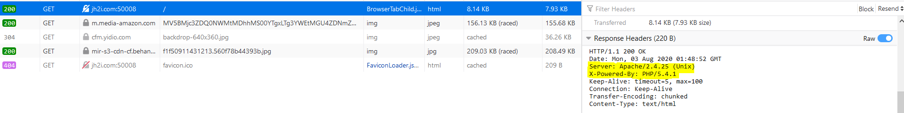
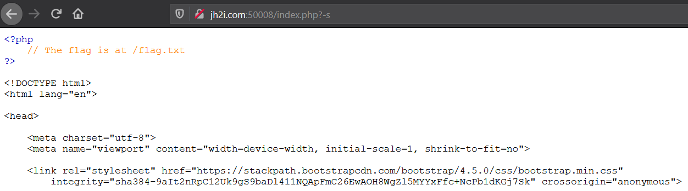
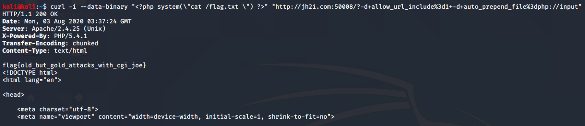

# GI Joe

## Problem

```
The real American hero!

Connect here:
http://jh2i.com:50008
```

## Solution

***Note**: solved after competition end*

Following the link takes us to a site about the G.I. Joe movie series. 



From the challenge name and the web page header (See GI), we can assume it has something to do with Common Gateway Interface or CGI. 
CGI are interface specifications for communication between a web server (which runs the website) and other programs on the server. 
This allows the web server to execute commands on the server (such as querying a database), and is mostly used to generate 
webpages dynamically. This type of communication is handled by CGI scripts which are often stored in a directory called 
`cgi-bin` in the root directory of the web server.



Looking at the response header values in inspector, we find that this website uses PHP version 5.4.1 and Apache version 2.4.25, this are quite old versions of both PHP (current version is 7.3) and Apache (current version is 2.4.43)
which are quite deprecated versions of PHP. Googling online, we find [this site](https://cve.mitre.org/cgi-bin/cvename.cgi?name=cve-2012-1823)
that explains how CGI can be used for arbitrary code execution.

Elaborating further:
* When we supply to the website a value with no parameter (i.e. no `=` symbol) the value is interpreted as options 
for the `php-cgi` program, which handles communication with the web server related to PHP.
* the options available are listed in the man page (under References). For example by using the `-s` flag we can output the 
source code for a PHP file. Thus by adding `?-s` to the url for a PHP file located on a vulnerable server we can view the 
source code of the file.

Let's try this on the index page (ie. `index.php`). By navigating to `/index.php?-s` we get the following:



Now we know that the flag is stored in `flag.txt` on the root directory of the server. Using the same vulnerability, we
can execute commands on the server through the `?-d` flag. This gives us the ability to change and define INI entries (or 
in other words change the configuration file of PHP). 

In order to run commands we need to change the option `auto_prepend_file` to `php://input`, which forces PHP to parse the 
HTTP request and include the output in the response. Also, we need to change the option `allow_url_include` to 1 to allow 
usage of `php://input`. By navigating to `/?-d allow_url_include=1 -d auto_prepend_file=php://input` and adding to the HTTP 
request some PHP code to execute commands on the system (`<?php system(<command>) ?>`), we can achieve arbitrary code execution 
on the server.

We can use `curl` with the `-i` flag to include the HTTP headers and `--data-binary` flag to add the PHP code to the HTTP request.
In the PHP code we'll use `cat /flag.txt` to output the content of the file. The command is:
```
curl -i --data-binary "<?php system(\"cat /flag.txt \") ?>" "http://jh2i.com:50008/?-d+allow_url_include%3d1+-d+auto_prepend_file%3dphp://input"
```




**Flag**: `flag{old_but_gold_attacks_with_cgi_joe}`

&nbsp;

#### References:
* [CVE-2012-1823](https://pentesterlab.com/exercises/cve-2012-1823/course)
* [CVE-2012-2311 (`-d` flag RCE)](https://cve.mitre.org/cgi-bin/cvename.cgi?name=cve-2012-2311)
* [php-cgi `man` page](https://www.systutorials.com/docs/linux/man/1-php-cgi/)