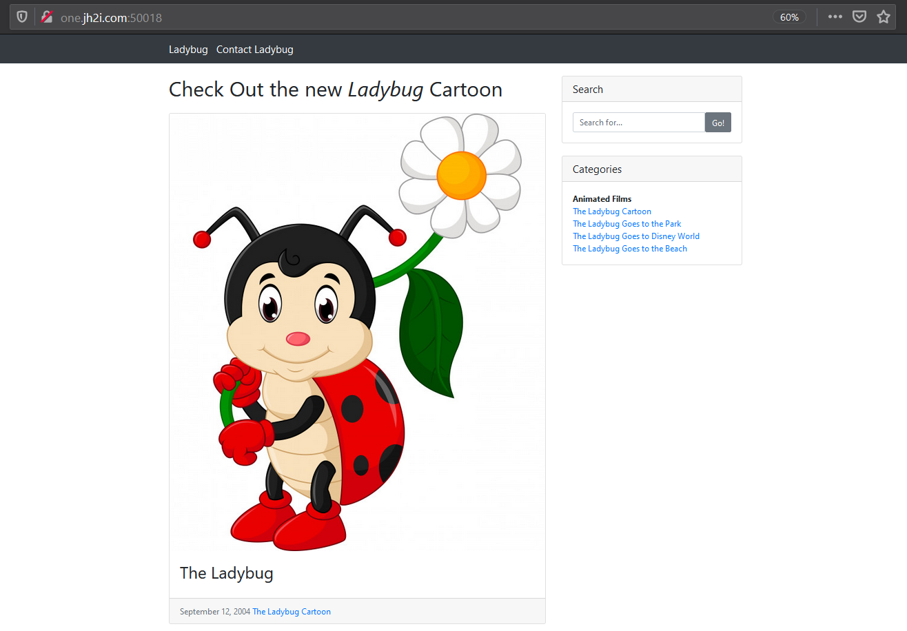
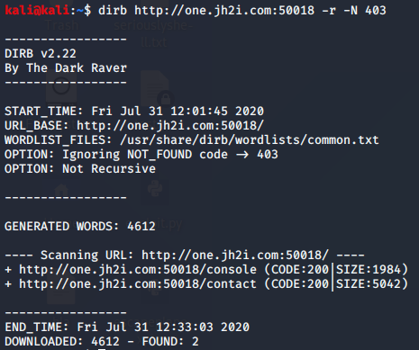
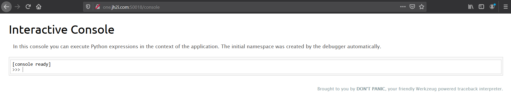
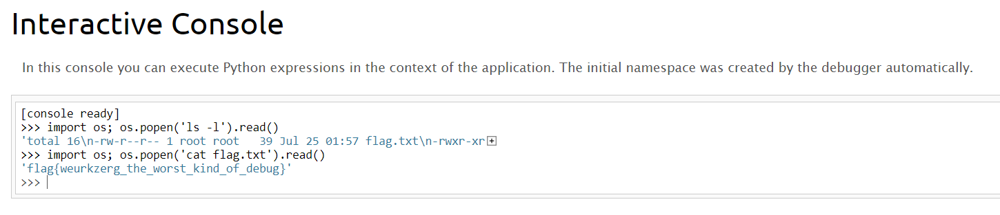

# Ladybug

## Problem

```
Want to check out the new Ladybug Cartoon? It's still in production, so feel free to send in suggestions!

Connect with one instance below:
http://one.jh2i.com:50018
http://two.jh2i.com:50018
http://three.jh2i.com:50018
http://four.jh2i.com:50018
http://five.jh2i.com:50018
http://six.jh2i.com:50018
```

## Solution

The link takes us to a webpage, with a link to an alternate endpoint `/contact` through "Contact Ladybug" containing a form that doesn't do anything
when input is submitted.



Reviewing source code, cookies, robots.txt doesn't return anything of interest, so we turn to fuzzing. Using `dirb`, we 
get the output below:



There seems to be a hidden directory endpoint `/console`. Accessing this takes us to a Python console, which sort of functions
like a shell "in the context of the application".




We search online on how to enumerate the directory in WerkZeug, and find that the `os` library in Python allows us to exploit RCE,
through the `popen` method.



**Flag**: `flag{weurkzerg_the_worst_kind_of_debug}`

&nbsp;

**NTS:**
* alternate method of command injection using `subprocess` library (link below):
```python
import subprocess;out = subprocess.Popen(['whoami'], stdout=subprocess.PIPE, stderr=subprocess.STDOUT);stdout,stderr = out.communicate();print(stdout);
```

#### References:
* https://www.tutorialspoint.com/python/os_popen.htm
* [writeup using `subprocess` library](https://github.com/W3rni0/HacktivityCon_CTF_2020/blob/master/readme.md)


