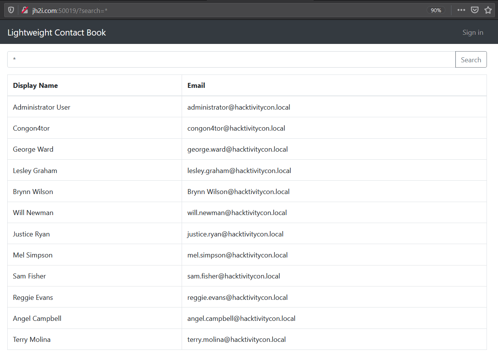
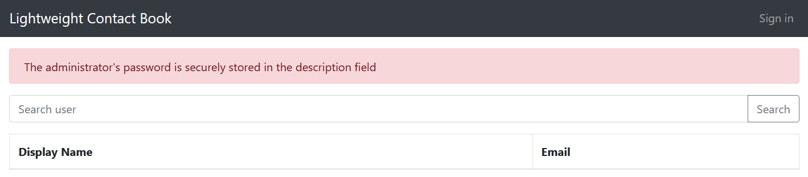
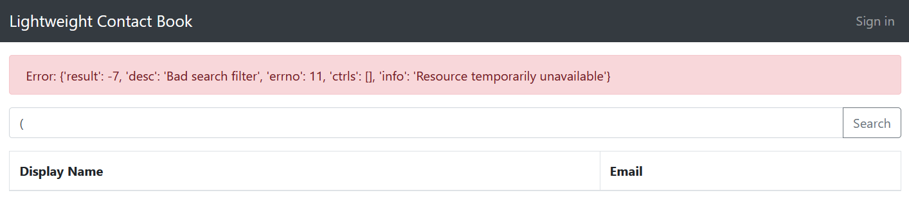
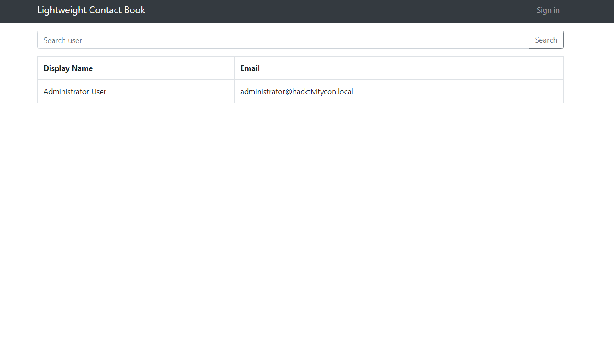
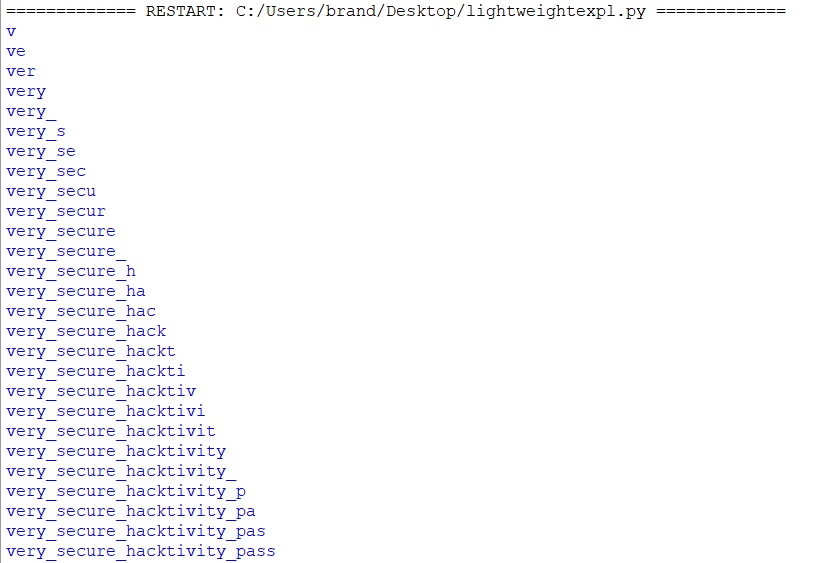
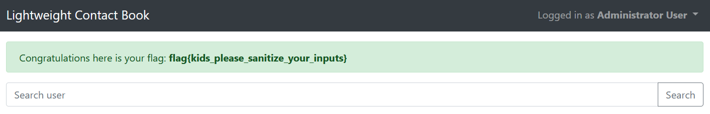

# Lightweight Contact Book

## Problem

```
Lookup the contact details of any of our employees!

Connect here:
http://jh2i.com:50019
```

## Solution

***Note**: solved after competition end*

The link takes us to a [page](images/lightweight1.PNG) where there are two main functions: searching for contacts and a login service.

Playing around with inputs, we find that asterisk (`*`) acts as a wildcard character that returns details of every entry.



The first user on the list `Administrator User` seems to be of interest. We open the login service to see if it is possible
to gain access to admin. The [login service](images/lightweight3.PNG) features a [password recovery option](images/lightweight4.PNG) this time. 
We try guessing the username for `Administrator User` and find that the username `administrator` gives this response:



So we know `administrator` is a valid username, likely for `Administrator User`. It also tells us passwords are stored in
the field `description`. We'll keep this in mind for later.

&nbsp;

Playing around with inputs more, we find if search input is a single open bracket `(`, it gives this error message:



Searching this error message online reveals that it is discovered that the webpage search uses Lightweight Directory Access 
Protocol (LDAP). LDAP is a protocol for accessing directory information services *(a shared information infrastructure, 
can be thought of as a database in the challenge context)* over the Internet.\
In this protocol, `*` is a wildcard character and filtering is done in the format `(<attribute>=<value>)`. Filters can 
also be appended together. 

Earlier we found that searching for `*` dumps the display name and email of all employees. Trying to search for `Admin*`, 
we can see that only the row containing `Administrator User` is returned.\
We can assume that the statement used by the search option is `(name=<search input>)` and that we need to discover the 
`description` field (ie. the password) for the employee with the name `Administrator User`.

&nbsp;

A common attack against LDAP is using LDAP injection which is very similar to SQL injection, a simple example is to search 
for 
```
*)(mail=administrator@hacktivitycon*
```
The statement that will be executed by our assumption is:

```
(name=*)(email=administrator@hacktivitycon.local)
```
and only the employee(s) with this email will be displayed, which gives us:



We can exploit LDAP injection. We want to obtain the password, which is stored in the `description` field of the user, 
but it cannot be displayed on screen. Instead, we can do something similar to blind SQL injection: by searching for 
`Admin*)(description=<string>*` and changing the value of `<string>` one character at a time:
* The value matches the password's regex (`<current string>*`) and the `Administrator User` row will be displayed 
on page as it matches both filters.
* The value does not match password's regex and search results will be empty, because it doesn't match the second filter.

We can bruteforce the password, checking if the next character in the password string is correct by searching for the 
`Administrator User` entry, and so on until no more characters can be added. The script is [here](files/lightweightexpl.py).



Eventually we find that the password is `very_secure_hacktivity_pass`.

Logging in with the credentials (`administrator/very_secure_hacktivity_pass`) gives us the flag.



**Flag**: `flag{kids_please_sanitize_your_inputs}`

&nbsp;

#### References:
* https://www.synopsys.com/glossary/what-is-ldap-injection.html
* [LDAP Injection Cheatsheet](https://github.com/swisskyrepo/PayloadsAllTheThings/tree/master/LDAP%20Injection)