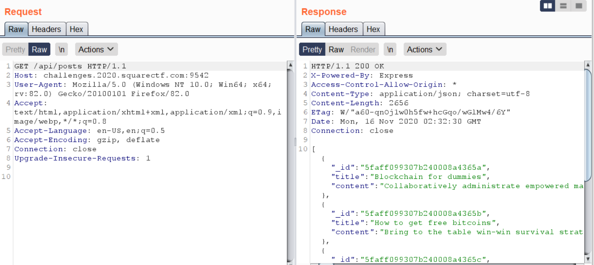
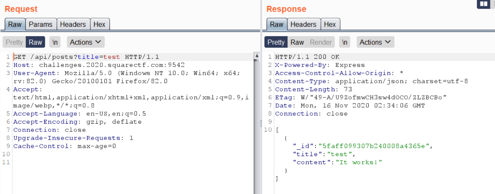
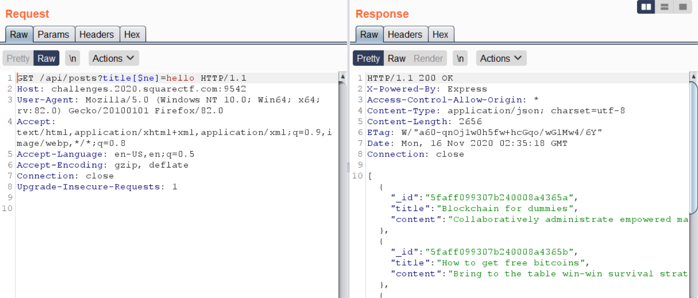
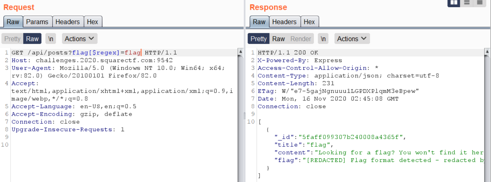
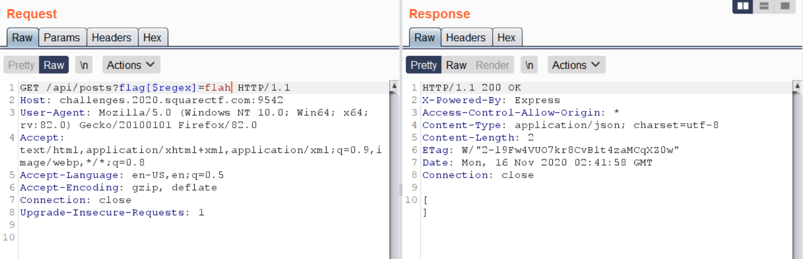
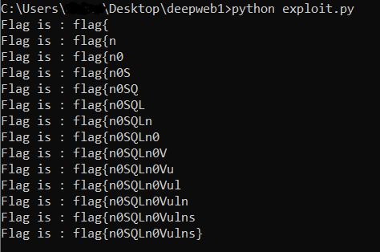

# Deep Web Blog

## Problem

```
A secret informant has tipped us off that hackers on the deep web have been plotting an attack on Square to steal our treasured Bitcoins...

Time to find what their plans are.
http://challenges.2020.squarectf.com:9541
```

## Solution

***Note**: solved after competition end*

Accessing the link takes us to [this page](images/deepweb1.PNG) containing several blog posts. The only functionality available is the search bar at the top right.

When we try to search something, using inspector we find that the page [queries an API endpoint](images/deepweb1a.PNG) at `https://challenges.2020.squarectf.com:9542/api/posts` ie the highlighted GET request.

We can view all the blog posts there by accessing the endpoint directly (using the URL above). It returns [all available blog posts](images/deepweb1b.PNG) that we can see in the page earlier:

```json
[
   {
      "_id":"5faff099307b240008a4365a",
      "title":"Blockchain for dummies",
      "content":"Collaboratively administrate empowered markets via plug-and-play networks. Dynamically procrastinate B2C users after installed base benefits. Dramatically visualize customer directed convergence without revolutionary ROI.\n\nEfficiently unleash cross-media information without cross-media value. Quickly maximize timely deliverables for real-time schemas. Dramatically maintain clicks-and-mortar solutions without functional solutions."
   },
   {
      "_id":"5faff099307b240008a4365b",
      "title":"How to get free bitcoins",
      "content":"Bring to the table win-win survival strategies to ensure proactive domination. At the end of the day, going forward, a new normal that has evolved from generation X is on the runway heading towards a streamlined cloud solution. User generated content in real-time will have multiple touchpoints for offshoring."
   },
   {
      "_id":"5faff099307b240008a4365c",
      "title":"My Favorite Tool: cipsum.com",
      "content":"Leverage agile frameworks to provide a robust synopsis for high level overviews. Iterative approaches to corporate strategy foster collaborative thinking to further the overall value proposition. Organically grow the holistic world view of disruptive innovation via workplace diversity and empowerment. Bring to the table win-win survival strategies to ensure proactive domination. At the end of the day, going forward, a new normal that has evolved from generation X is on the runway heading towards a streamlined cloud solution. User generated content in real-time will have multiple touchpoints for offshoring. Capitalize on low hanging fruit to identify a ballpark value added activity to beta test. Override the digital divide with additional clickthroughs from DevOps. Nanotechnology immersion along the information highway will close the loop on focusing solely on the bottom line."
   },
   {
      "_id":"5faff099307b240008a4365d",
      "title":"manifesto",
      "content":"Another one got caught today, it's all over the papers.  \"Teenager\nArrested in Computer Crime Scandal\", \"Hacker Arrested after Bank Tampering\"...\n        Damn kids.  They're all alike.\n\n        But did you, in your three-piece psychology and 1950's technobrain,\never take a look behind the eyes of the hacker?  Did you ever wonder what\nmade him tick, what forces shaped him, what may have molded him?\n        I am a hacker, enter my world...\n        Mine is a world that begins with school... I'm smarter than most of\nthe other kids, this crap they teach us bores me...\n        Damn underachiever.  They're all alike."
   },
   {
      "_id":"5faff099307b240008a4365e",
      "title":"test",
      "content":"It works!"
   }
]
```

We can get the same result through Burpsuite, using `GET /api/posts`:



One other thing noticeable was the addition of the `title` parameter. If we query like `/api/posts?title=search_input` it returns posts whose title attribute matches *exactly* the search input. For example, using `test` as input, we should get the corresponding post.



At this point, I tried various SQLi payloads, but to no avail. An interesting thing about the API response is that the id field is named _id instead of id. This is a convention usually seen in MongoDB, and it is likely the database is not SQL!

We then try querying the API with a noSQLi attack using [$ne]:



`?title[ne]=hello` returns all posts with title not equal to hello. As expected, all the posts are returned. Hence we now know that noSQL injection is possible.

Another interesting thing is when we inspect the front-end of the page further, the front end has an App.js [file](files/deepweb/App.js) with an interesting part:

```js
this.state.projects.length > 0 ?
              this.state.projects.map(project =>
                <div class="post">
                  <Project animate header={project.title} >
                    {anim => (
                      <div>
                        <Words animate show={anim.entered}>
                          { project.content }
                        </Words>
                        {
                          project.flag && <Words animate layer='alert'>{project.flag}</Words>
                        }
                      </div>
                    )}
                  </Project>
                </div>
```

This means that each post has a hidden `flag` attribute that we do not see in the API response.

We try querying with `flag[$regex] = .*` (.* being the wildcard character). This should return all the posts we saw earlier. Instead, we get a [different response](images/deepweb5.PNG):

```json
[
   {
      "_id":"5faff099307b240008a4365f",
      "title":"flag",
      "content":"Looking for a flag? You won't find it here. Maybe this can help: https://www.youtube.com/watch?v=Jbix9y8iV38",
      "flag":"[REDACTED] Flag format detected - redacted by WAF"
   }
]
```

This message will be returned if the regex is found in the flag. This means it can help tell us *if a certain substring is a part of the flag*. 



We also know that the search results are returned as a JSON object. So if you check for a substring that isn’t a part of the flag, there will be no results to return and thus it returns an empty JSON string. For example if we set the regex to `flah` (an obviously wrong string):



We can use this information to bruteforce the exact flag string: if the next character returns the above message we add it to our existing flag string and repeat until the entire flag string is obtained. The script can be found [here](files/deepweb/exploit.py).



**Flag**: `flag{n0SQLn0Vulns}`

&nbsp;

#### References:
* https://owasp.org/www-pdf-archive/GOD16-NOSQL.pdf
* https://www.objectrocket.com/blog/mongodb/code-injection-in-mongodb/
* https://github.com/cr0hn/nosqlinjection_wordlists/blob/master/mongodb_nosqli.txt
