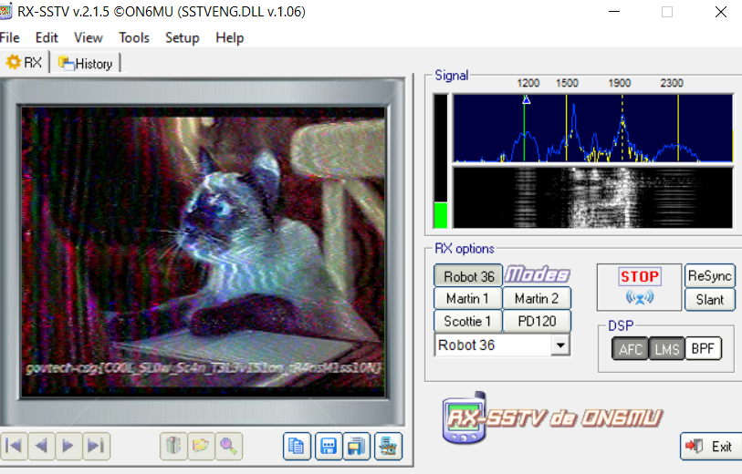

# Beep Boop

## Problem

```
As part of forensic investigations into servers operated by COViD, an investigator found this sound file in a folder labeled "SPAAAAAAAAAAAAAAAAAACE". Help us uncover the secret of the file.

Please view this Document for download instructions.
```

## Solution 

The clue in the description, "SPAAAAAAAAAAAAAAAAAACE", is a hint for us to use SSTV decoder to decode the .wav file. Using RX-SSTV, we can obtain the flag within the image produced.

Settings: Robot36, AFC/LMS on, BPF off



**Flag**: `govtech-csg{C00L_SL0w_Sc4n_T3L3v1S1on_tR4nsM1ss10N}`

&nbsp;

#### References:
* http://users.belgacom.net/hamradio/rxsstv.htm