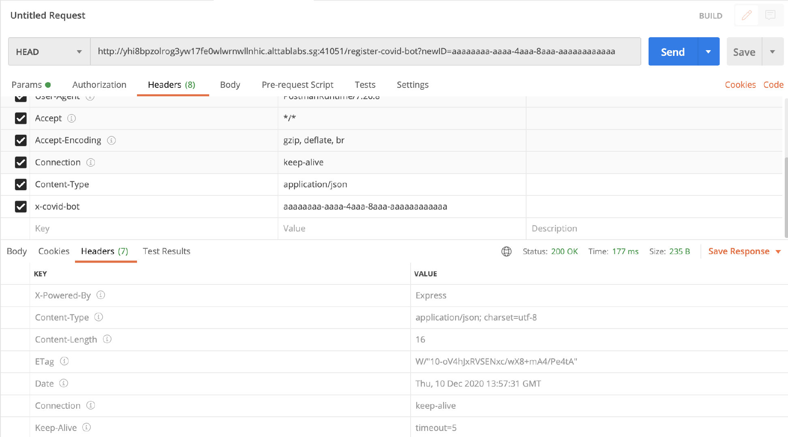
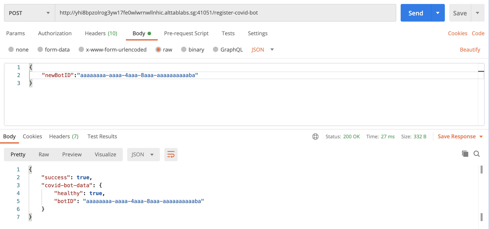
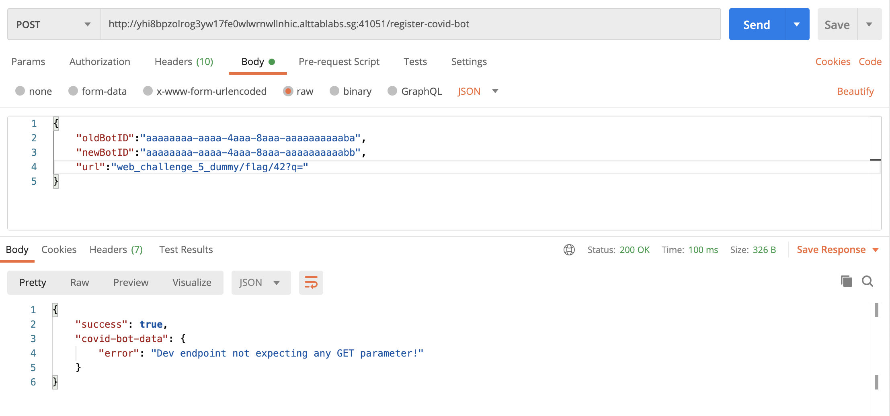
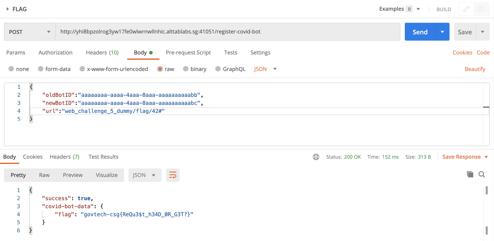
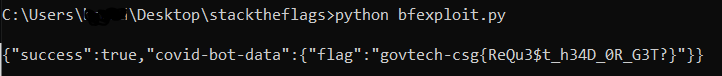

# Breaking Free

## Problem

```
Our agents managed to obtain the source code from the C2 server that COViD's bots used to register upon infecting its victim. Can you bypass the checks to retrieve more information from the C2 Server?

C2 Server

Please view this Document for download instructions.

ZIP File Password: web-challenge-5
```

## Solution

***Note:* solved after competition end**

We are given the [source code](./files/breakingfree/dist.js) for a single file. Looking through, at the bottom in `fetchResource` async function there is a TODO comment telling us what we need to do: access the endpoint `http://web_channelge_5_dummy/flag/42` to get the flag.

```javascript
async function fetchResource(payload) {
  //TODO: fix dev routing at backend http://web_challenge_5_dummy/flag/42
  let result = await axios.get(`http://${payload.url}/${payload.newBotID}`).catch(err => { return { data: { "error": true } } });
  return result;
}
```

We find also, 3 functions in the router handling different types of requests:

Firstly, the .use function defines a middleware function which applies to all requests that are made to the `/register-covid-bot` endpoint: GET, POST or any other request type, before passing it to the relevant routes.

```javascript
router.use("/register-covid-bot", (req, res, next) => {
  var invalidRequest = true;
  if (req.method === "GET") {
    if (req.query.COVID_SECRET && req.query.COVID_SECRET === COVID_SECRET) {
      invalidRequest = false;
    }
  } else {//Handle POST
    let covidBotID = req.headers['x-covid-bot']
    if (covidBotID && covidBotID.match(COVID_BOT_ID_REGEX)) {
      invalidRequest = false;
    }
  }

  if (invalidRequest) {
    res.status(404).send('Not found');
  } else {
    next();
  }

});
```
Here we see that it checks first whether the request made is GET or otherwise. It then checks based on various conditions whether the request is valid, and if not, it errors out and we are unable to proceed.

* If a GET request is made, the app checks whether the request provides a `COVID_SECRET` parameter and if so, validates it against an existing environment variable of the same name.
* If any other request method is used, the app validates the value of the x-covid-bot header that the user supplies against the given regex. Using a regex testing website, we can see that it looks for a UUID, but with some additional constraints (3rd segment starts with "4" and 4th part starts with "8","9","a","b","A" or "B")

Clearly, since the environment variables are not disclosed to us, it is unlikely that a GET request is our attack vector. However, let us further analyse the file to formulate our plan.

The second function:

```javascript
//registers UUID associated with covid bot to database
router.get("/register-covid-bot", (req, res) => {
  let { newID } = req.query;

  if (newID.match(COVID_BOT_ID_REGEX)) {
    //We enroll a maximum of 100 UUID at any time!!
    dbController.addBotID(newID).then(success => {
      res.send({
        "success": success
      });
    });
  }
});
```
This route obtains a newID from the GET request sent to `/register-covid-bot`, checks it against the specific UUID regex from before, then registers it in the database.

The last function:

```javascript
const COVID_BACKEND = "web_challenge_5_dummy";

router.post("/register-covid-bot", (req, res) => {
  let payload = {
    url: COVID_BACKEND,
    oldBotID: req.headers['x-covid-bot'],
    ...req.body
  };
  if (payload.newBotID && payload.newBotID.match(COVID_BOT_ID_REGEX)) {
    dbController.changeBotID(payload.oldBotID, payload.newBotID).then(success => {
      if (success) {
        fetchResource(payload).then(httpResult => {
          res.send({ "success": success, "covid-bot-data": httpResult.data });
        })


      } else {
        res.send({ "success": success });
      }
    });
  } else {
    res.send({ "success": false });
  }

});

async function fetchResource(payload) {
  //TODO: fix dev routing at backend http://web_challenge_5_dummy/flag/42
  let result = await axios.get(`http://${payload.url}/${payload.newBotID}`).catch(err => { return { data: { "error": true } } });
  return result;
}
```
This route obtains information from the request body and merges it into the payload object using the spread operator `...`. We can then assume that the changeBotID function replaces the oldBotID in the database with the newBotID (provided in request body and validated with UUID regex), then calls fetchResource if it succeeds. The `fetchResouce` function makes a GET request to the `COVID_BACKEND URL`, with our newBotID as the path. As per the aforementioned TODO comment, we need to redirect the request to the specified URL probably.

### Exploit

To get to the flag, we need to make a POST request, somehow modifying the URL parameter to point to the flag location and supply bot IDs that pass the checks. However in order for this to happen, we need to first register our bot ID, which supposedly requires knowing the environment variable `COVID_SECRET`.

However, upon some searching about request methods, we find that that the GET handler in Express.js also handles HEAD requests.

Upon some Googling, we see that HEAD requests are basically GET requests but without the message body in the return message. This also overcomes the hurdle that checks the COVID_SECRET, as the `req.method` is now `"HEAD"`, not `"GET"`! So the request instead processes the else clause in the middleware `app.use` function, which only validates the `x-covid-bot` header which we control.

Thus we make a HEAD request, providing both the `x-covid-bot` header, alongside the query parameter `newID`. Note the Content-Length header of the response; it indirectly tells us the response of the server even without the actual message body(not given due to the HEAD request). We can get either `{"success":true}` (16 characters) or `{"success":false}` (17 characters), so getting a Content-Length header of 16 indictates out bot is successfully registered.



Now that we have registered our bot, we need to use the changeBotID functionality through a POST request. We can make a basic POST request, with the our registered ID as the `x-covid-bot` header and a JSON request body containing our new bot ID (we see `app.use(bodyParser.json())` at the top of `dist.js`):

The `"covid-bot-data"` part shows the result of the fetchResource function we saw earlier! Now all that is left to do is to overwrite the `"url"` value in the payload object.



Now all we have to do is overwrite the `payload.url` value with `"web_challenge_5_dummy/flag/42?q="`, the last part ensuring that the `payload.newBotID` part is no longer included in the path, instead bundled up as a query passed to the dev endpoint.

The next step is to notice that the spread operator `({...obj})` can in fact overwrite variables. Hence, our final step is to overwrite the `payload.url` value using this feature:



Oops! The endpoint does not expect a GET parameter. Remember that we are supplying the newBotID as the GET parameter by using `?q=` at the end of our URL. We need to find a new way for the ID to not be included in our path.

Looking at the list of reserved characters for URLs, we come across `#`, which symbolises an anchor. We can try using this to remove the ID from our URL path instead:



**Flag**: `govtech-csg{ReQu3$t_h34D_0R_G3T?}`

&nbsp;

#### References:
* [Spread operator `...`](https://davidwalsh.name/merge-objects)
* [Anchor tags](https://www.quora.com/What-does-a-hashtag-at-the-end-of-a-URL-do)

---

**Note:** This python script works as well:
