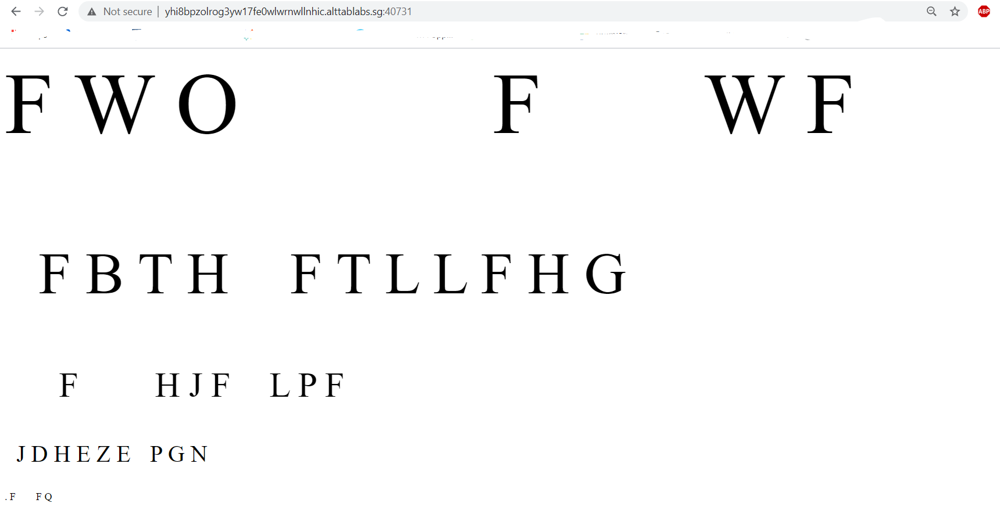
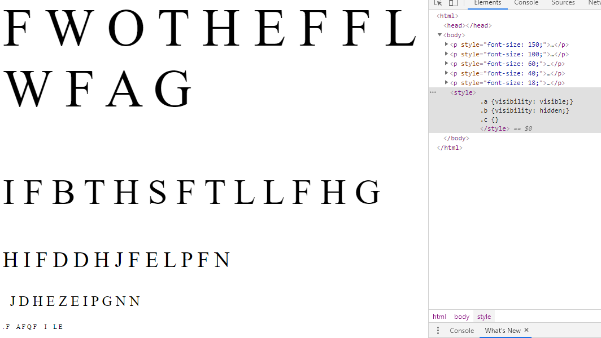
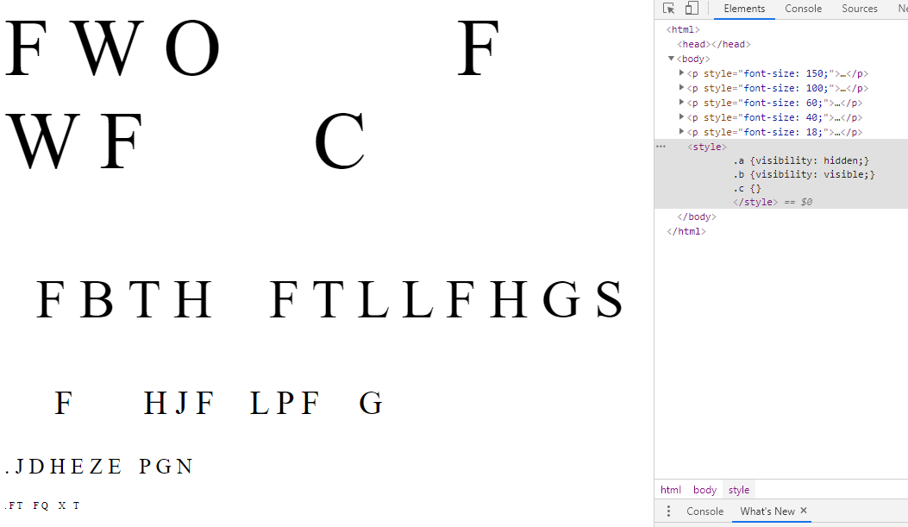
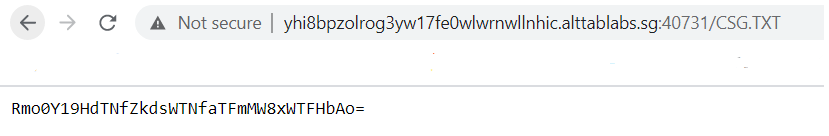
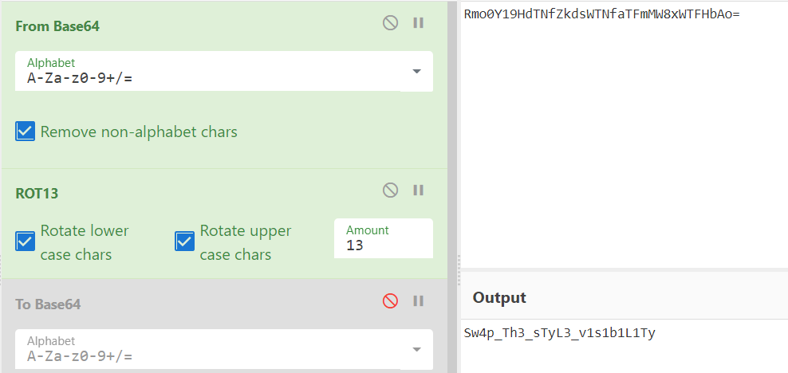

# FWO FWF

## Problem

```
As part of forensic investigations into servers operated by COViD, an investigator found this web server containing a hidden secret. Help us find the contents of this secret.

Web Server
```

## Solution

We are presented with a page containing a bunch of random assorted characters.



By inspecting the page elements, there are are some attributes under a style tag labelled `a`, `b` and `c` with visibility set to different values.

Playing around with these, we try change the values from 'hidden' to 'visible'. Doing so will cause more additional letters to pop up on the screen. 





Looking at the first line of letters produced by setting `a` to visible, the letters from the challenge name show up there. Interestingly, covering these letters will produce a partial message: `THEFLAG`. Perhaps what we need to do is obtain the new letters that are produced by each of the attributes, and it will reveal a hidden message.

```
.a: THE FLAG IS HIDDEN IN A FILE.

.b: CSG.TXT 
```

We try accessing `/CSG.TXT` as hinted by the clues, and the endpoint contains a base64 encoded string:



We try putting these values into CyberChef, and find that it is not only base64-encoded, but also a ROT-13 cipher. 



Wrapping this in the flag format gives us the final flag.

**Flag**: `govtech-csg{Sw4p_Th3_sTyL3_v1s1b1L1Ty}`