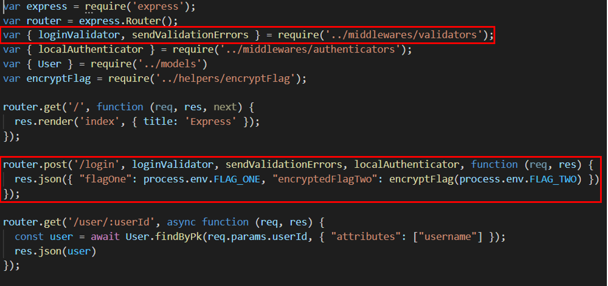
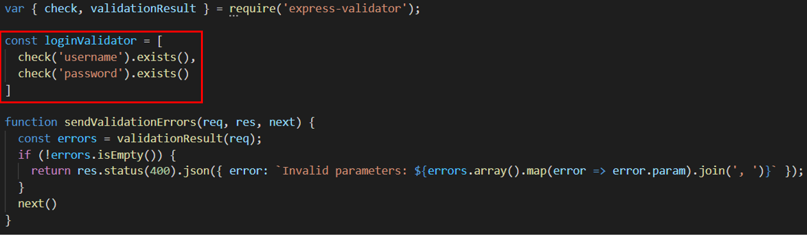
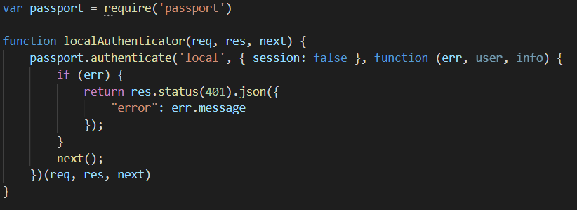
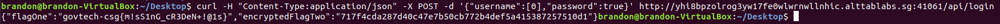

# Logged In

## Problem

```
It looks like COViD's mobile application is connecting to this API! Fortunately, our agents stole part of the source code. Can you find a way to log in?

API Server
```

## Solution

***Note**: solved after competition end*

We were provided with the source code for this challenge. By analyzing the main [source code](./files/loggedin/source/app.js) as well as the [API](./files/loggedin/source/routes/api.js), we find it is an ExpressJS application containing middleware that does error handling and validation on two request parameters, `username` and `password`, before authenticating the specified credentials.

Inspecting `api.js` further, we find that the `/login` route using POST contains the flag that we need. Let's breakdown the control flow for this route:

### API Control Flow
1. User sends a POST request to http://yhi8bpzolrog3yw17fe0wlwrnwllnhic.alttablabs.sg:41061/api/login, along with the parameters for `username` and `password` in the request body.
2. The API application checks if `username` and `password` exists, using the validation and authentication scripts in the [middlewares](../middlewares) folder of the source code.



Specifically, the validation check in [validators.js](../middlewares/validators.js) is performed by calling the function `validationResult` from `express-validator` package, which uses the validation criteria specified by the `check('xxx')` function, in `const loginValidator`. If both the `username` and `password` parameters exist, `validationResult` will return will no errors, and the program will continue it's flow.



If either one does not exist, a Status 400 error will be returned, stating that specific parameters were invalid.

3. Following the flow after sendValidationErrors returns no errors, `loginAuthenticator` in [authenticators.js](../middlewares/authenticators.js) will be executed.



If a user is successfully authenticated, it will return to the `router.post` section and continue its flow with no errors, returning a JSON response with the flag.

Upon further inspection of the validation checks, the `exists()` function in `const loginValidator` could have an improper implementation for a login input validation.

```javascript
const loginValidator = [
	check('username').exists(),
	check('password').exists()
]
```

Researching about the `exists()` function, it seems that this criteria for validation only checks if the specified parameter **ONLY** returns ***false*** if the parameter is of type `undefined`.

This means that by specifying the `username` and `password` parameters with no values in the POST request, these parameters will be defined, and is of type `null`, bypassing the validation checks in ```validationResult(req)``` completely.

> Read: [StackOverflow: Should .exists() check for null values as well?](https://github.com/express-validator/express-validator/issues/473)

After bypassing the validators, we still have to get past the authenticator functions. But how does that happen with our emtpy inputs? As the `null` parameters are passed into the authentication function, `passport.authenticate` will attempt to authenticate a user based on the `username` parameter. However, as both credentials are `null`, the application is unable to retrieve a valid user model (from db or storage), and does not return an error. This flows the execution down toward the `next()` function which flows back to `router.post` and executes the supposedly authenticated code, returning to us the flag.



### Proposed Patches (cr: redfl4g)

Regarding the ```express-validator``` validation checks, the validation bypass with null values could be fixed by specifying ```checkFalsy: true```, to classify ```"", '0', 'false', null``` values as parameters that does not exist (exists() will return false). 
```javascript
const loginValidator = [
	check('username').exists({ checkFalsy: true }),
	check('password').exists({ checkFalsy: true })
]
```

Regarding the ```loginAuthenticator``` function, instead of specifying a ```next()``` function at the end of the code, there should be a check if the ```user``` model is valid and authenticated, and return an error.
```javascript
function localAuthenticator(req, res, next) {
	passport.authenticate('local', { session: false }, function (err, user, info) {
		if (err) {
			return res.status(401).json({
				"error": err.message
			});
		}
		if (! user) {
			return res.send(401,{ success: false, message: 'authentication failed' });
		}
		else{
			// Authenticated
		}
	})(req, res, next)
}
```
## Conclusion (cr: redfl4g)

This challenge involved learning the basics about ExpressJS Middleware as well as dissecting the code to understand it's processing functions from external libraries.

The main vulnerability in this challenge was the improper use of an external library ([express-validator](https://express-validator.github.io/)) that attempts to validate request parameters/user inputs. With improper validation, users are able to bypass the login authenticator function, which led to the flow of execution to sections where only (supposedly) authenticated users are allowed to execute.

**Flag**: `govtech-csg{m!sS1nG_cR3DeN+!@1s}`

&nbsp;

#### References:
* https://www.mdeditor.tw/pl/204G
* [Understanding Express Middleware through Examples](https://developer.okta.com/blog/2018/09/13/build-and-understand-express-middleware-through-examples)
* [Learn Express Middleware in 14 Minutes](https://www.youtube.com/watch?v=lY6icfhap2o)