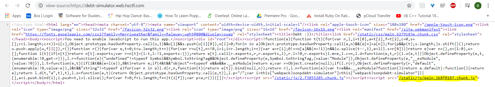
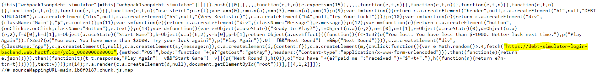
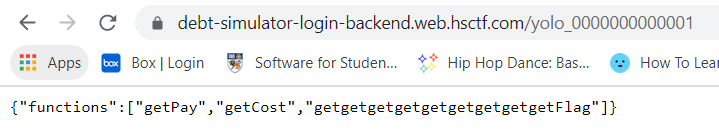
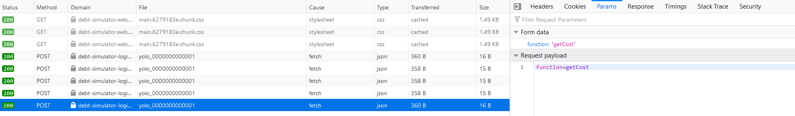
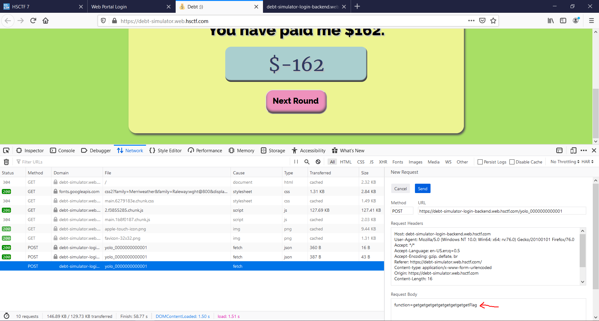
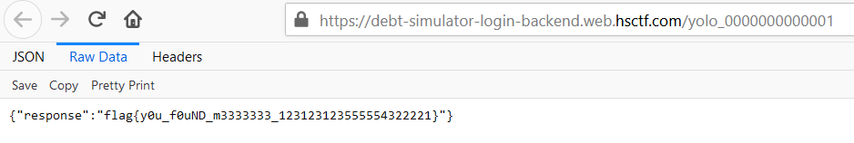

# Debt Simulator

## Problem

```
https://debt-simulator.web.hsctf.com/

Author: Madeleine
```

## Solution

Viewing the page source, we can observe several .js scripts being called. In particular, the main.js script fetches 
resources from a backend site.







We can see that this backend site contains 3 functions: `getPay`, `getCost`, `getgetgetgetgetgetgetgetgetFlag`. 
If we check the console, we see that everytime the "Next Round" button is pushed, it sends a POST request. In this request body, 
it calls either `getPay` or `getCost`, but never `getget...Flag`. We simply send a POST request that calls `getget...Flag`
function in the body. The response contains the flag.







Flag: `flag{y0u_f0uND_m3333333_1231231235555544322221}`