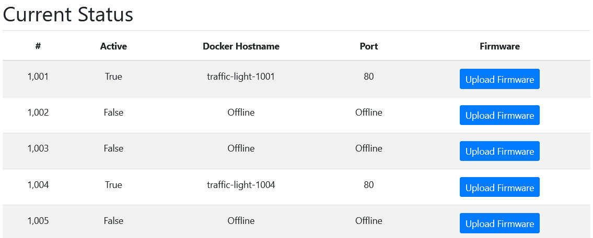

# Traffic Lights W

## Problem

```
🚦Can you figure out what's going on with this shady company?

https://traffic-light-w.web.hsctf.com/

Author: meow
```

## Solution

The #1001 firmware link redirects us to a page that allows us to upload XML code. This is a clue for us to
conduct an XXE injection. We use the injection code as per example below:

```
<?xml version="1.0" encoding="ISO-8859-1"?>
<!DOCTYPE root [<!ENTITY xxe SYSTEM "file:///etc/passwd/">]>
<root>
  <content>&xxe;</content>
</root>
```

Submitting this code on the firmware upload link will give us the contents of `/etc/passwd/`:


Now we need to conduct an SSRF on the web server using the XXE. We notice that the index page contains some interesting information about 
hostnames and ports:



Since #1001 and #1004 are the only 2 active points, we try both `http://traffic-lights-1001:80` and 
`http://traffic-lights-1004:80` as SYSTEM input in the XXE injection. The latter returns the flag.


Flag: `flag{shh_im_mining_bitcoin}`