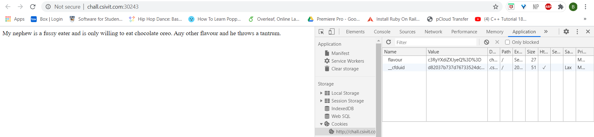
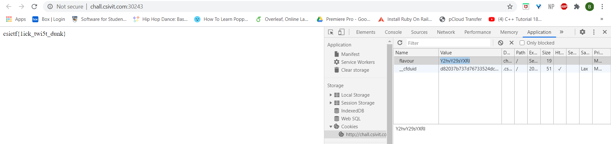

# Oreo

## Problem

```
My nephew is a fussy eater and is only willing to eat chocolate oreo. Any other flavour and he throws a tantrum.

http://chall.csivit.com:30243
```

## Solution

Accessing the link takes us to this webpage with a single line:



Immediately the challenge name signals that cookies are involved, so we check the cookies and find a token of interest `flavour`.

`%3D` is unicode for `=`, so it seems the value is base64 encoded. Decoding it gives us the string `strawberry`.

Based on the line in the webpage, we need to change `flavour` to `chocolate`. 

Change the `flavour` token to `Y2hvY29sYXRl`; base64 encoded value of `chocolate` and reloading the page gives us the flag.



**Flag**: `csictf{1ick_twi5t_dunk}`

