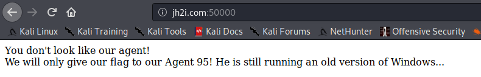
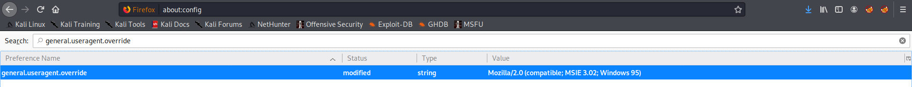
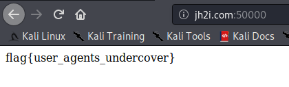

# Agent 95

## Problem

```
They've given you a number, and taken away your name~

Connect here:
http://jh2i.com:50000
```

## Solution

Accessing the link gives us this page:



From the challenge name and description, we can infer that the solvepath is related to User-Agents. After doing some
research, we learn that it is possible to spoof your User-Agent.

This method closely follows [this video](https://www.youtube.com/watch?v=ujK2-h-NkIk).

The User-Agent can be obtained from online sites like [this](https://humanwhocodes.com/blog/2010/01/12/history-of-the-user-agent-string/).

Our solvepath involves spoofing the browser User-Agent to Windows 95. In Firefox access about.config file through the searchbar,
and add the preference `general.useragent.override = Mozilla/2.0 (compatible; MSIE 3.02; Windows 95)`



Reloading the original page gives us the flag.



**Flag**: `flag{user_agents_undercover}`