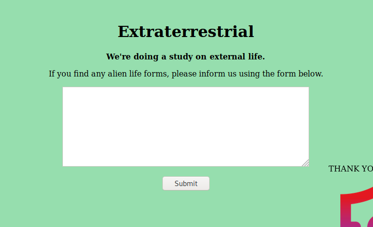

# Extraterrestrial

## Problem

```
Have you seen any aliens lately? Let us know!

The flag is at the start of the solar system.

Connect here:
http://jh2i.com:50004
```

## Solution

Accessing the page, we encounter a form:

***Note**: solved after competition end*



This is a red flag to conduct XXE injection. We try to submit an SSRF for `/etc/passwd` and it indeed returns us the 
contents of `/etc/passwd/`:


Now we just need to find the filepath of flag. The challenge description suggests the flag is located in root directory 
`/`.

We try an SSRF for `/flag.txt` (substitute `file:///etc/passwd/` for `file:///flag.txt`:


**Flag**: `flag{extraterrestrial_extra_entities}`