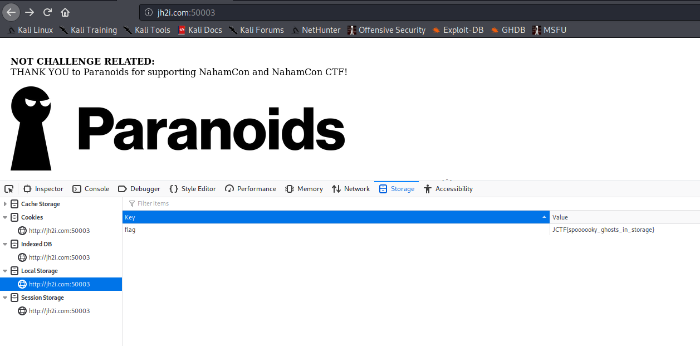

# Localghost

## Problem

```
BooOooOooOOoo! This spooOoOooky client-side cooOoOode sure is scary! What spoOoOoOoky secrets does he have in stooOoOoOore??

Connect here:
http://jh2i.com:50003

Note, this flag is not in the usual format.
```

## Solution

Very straightforward, just check local storage in developer tools. 



**Flag**: `JCTF{spooooooky_ghosts_in_storage}`