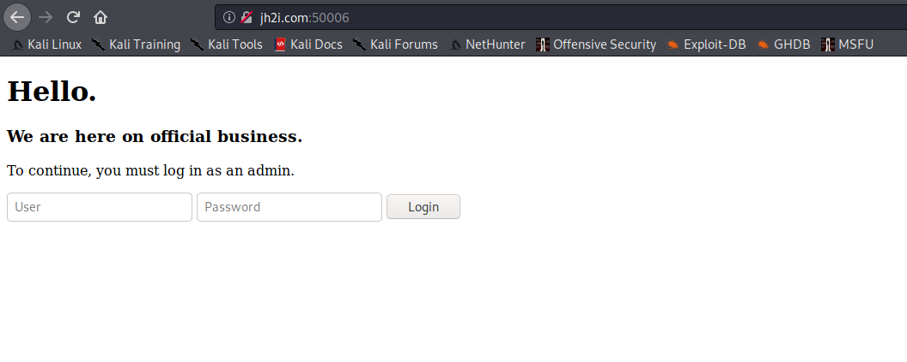
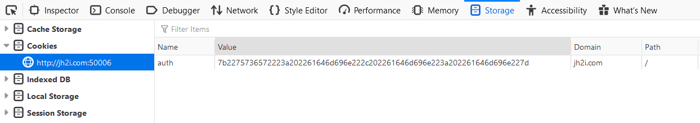
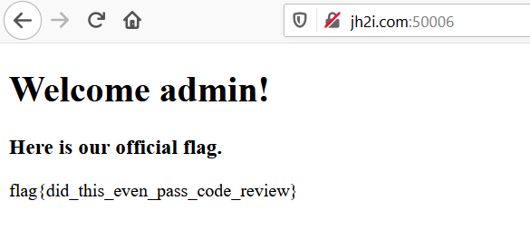

# Official Business

## Problem

```
Are you here on official business? Prove it.

Connect here:
http://jh2i.com:50006
```

## Solution

***Note**: solved after competition end*

Accessing the link brings us to this site telling us we need to log in as admin to continue. 



Searching `/robots.txt` reveals the [source code](files/officialbusiness/robotstxt_script.py) for authentication.

We look at the login function:

```python
@app.route("/login", methods=["POST"])
def login():

    user = request.form.get("user", "")
    password = request.form.get("password", "")

    if (
        user != "hacker"
        or hashlib.sha512(bytes(password, "ascii")).digest()
        != b"hackshackshackshackshackshackshackshackshackshackshackshackshack"
    ):
        return abort(403)
    return do_login(user, password, True)
```

There is no way for us to obtain a `password` whose hash matches the value specified. It is impossible for us to break 
this layer of authentication.

```python
def load_cookie():

    cookie = {}
    auth = request.cookies.get("auth")
    if auth:

        try:
            cookie = json.loads(binascii.unhexlify(auth).decode("utf8"))
            digest = cookie.pop("digest")

            if (
                digest
                != hashlib.sha512(
                    app.secret_key + bytes(json.dumps(cookie, sort_keys=True), "ascii")
                ).hexdigest()
            ):
                return False, {}
        except:
            pass

    return True, cookie
```

Instead, we can try to bypass `/login` through the `/` endpoint instead. `load_cookie()` employs a try-catch block checking
for a cookie `auth`. It is inferred we can spoof our own `auth` that will be accepted as long as it causes an error.

We can thus write an [exploit script](./files/officialbusiness/ofbexploit.py) to generate a fake cookie value (simply no `digest` value)
that invokes an error in `load_cookie()` and bypasses the authentication.

On `http://jh2i.com:50006/`, we create an `auth` token via the web console and input the fake value.



Reload to get the flag.



**Flag**: `flag{did_this_even_pass_code_review}`