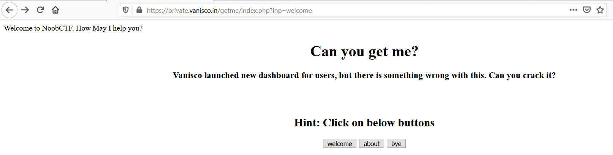
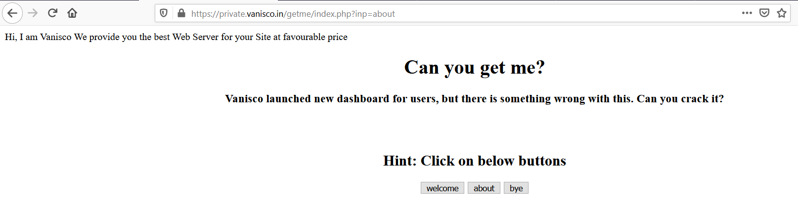
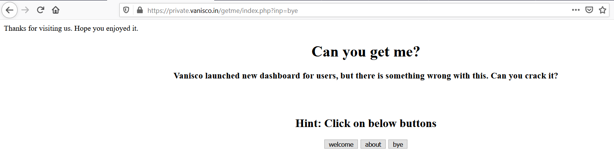
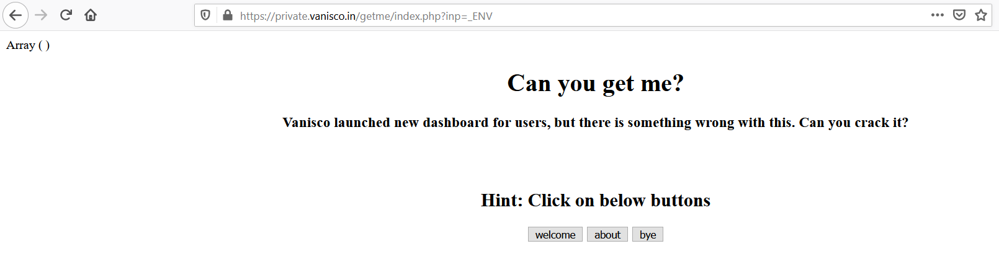
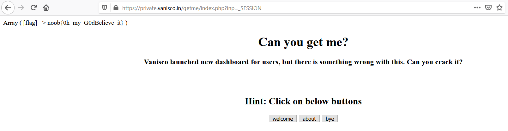

# Get Me

## Problem

```
https://private.vanisco.in/getme/

Author: Vanisco
```

## Solution

***Note**: solved after competition end*

Accessing the link, we get this page with 3 different buttons: `welcome`, `about`, `bye`. Clicking each of the buttons
gives us a different message at the top of the page.







We notice that there is a parameter `inp` in the URL; each button, when pressed, sends a GET request to the server, with 
different values for the `inp` URL parameter. 

From the challenge author:
```
In background it was like 
print_r(${$_GET['inp']});

So everything which will be passed as GET parameter will act as variable in php.
```
This means the background script of the challenge PHP page prints the value of the variable that is specified by `inp` parameter in the GET request.
For example, 
```
...index.php?inp=welcome

print_r(${$_GET['inp']}) => print_r($welcome);
```

We try to see if other special variables can be called, particularly the [superglobal variables](https://www.php.net/manual/en/language.variables.superglobals.php).
For example, let `inp` = `_ENV`, a superglobal variable:



It works! We play around with other superglobal variables and find `_SESSION` contains the flag which is printed out:



**Flag**: `noob{0h_my_G0dBelieve_it}`