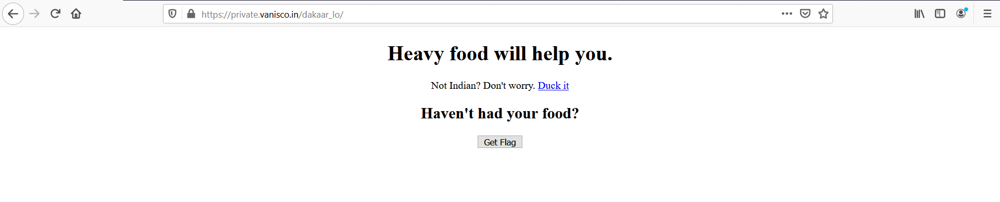
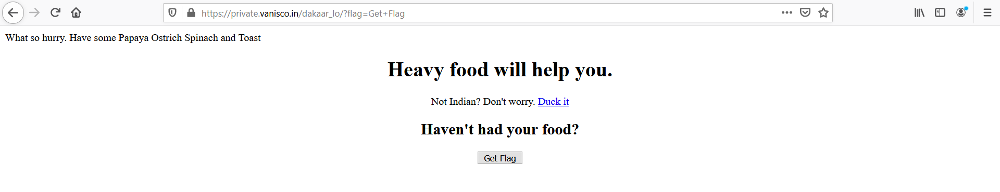
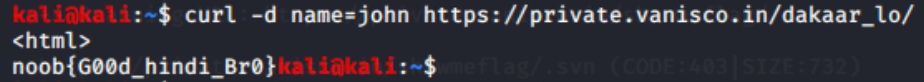

# Just For Fun

## Problem

```
https://private.vanisco.in/dakaar_lo/

Author: Vanisco
```

## Solution

Accessing the link, we see this page:



We click the button `"Get Flag"`, and it reloads the page with a new string at the top:



Papaya, Ostrich, Spinach and Toast; that's an acronym for POST. So maybe we need to send a POST request to the site.
Open up terminal and use `curl` to send a POST request to the webpage. The response contains the flag.



**Flag**: `noob{g00d_hindi_br0}`