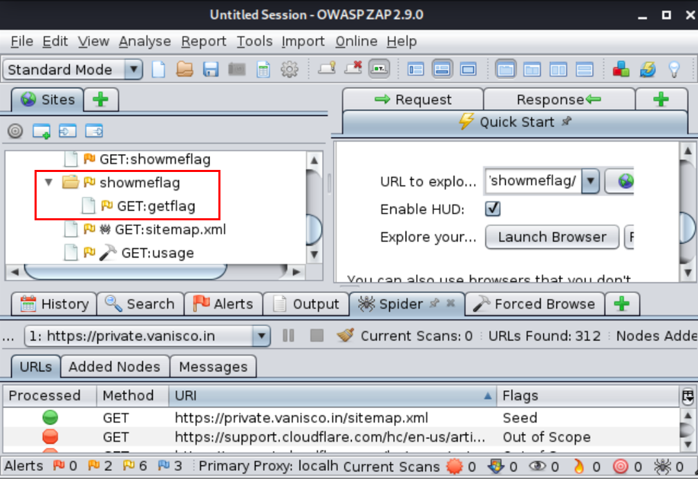
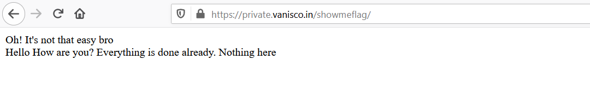
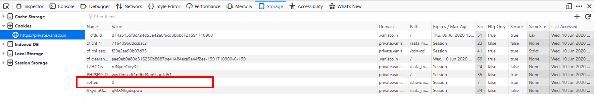
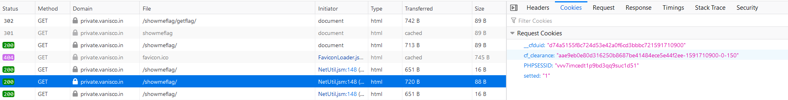
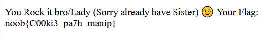

# show_me_flag

## Problem

```
https://private.vanisco.in/showmeflag/

Author: Vanisco
```

## Solution

Accessing the link, we arrive at a page with a single line:

```
Hello! How are you? Everything is done already. Nothing here
```

There is nothing of interest when we look at the page source code, so perhaps we can try enumerating hidden directories. Using 
OWASP ZAP, we discover an interesting directory `/getFlag/`:



So we try accessing `https://private.vanisco.in/showmeflag/getFlag/` via the browser. However it merely returns an extra line:



Clearly this is not so straightforward. 

We look at the session cookies to see if we can gain any interesting insights. There, we can discover an interesting cookie `setted`.
Everytime the page is reloaded, it is set to 0:



Perhaps we can try changing `setted` to a non-zero value and see what happens. At first, we resend the GET request for `getFlag` page,
with `setted` changed to `123`. In the response, the page shows a new line: 

```
Wrong Value Dear
```

We must be close. There must be a specific value that could return the flag. Trying the value `1`:


We get the flag in the response.



**Flag**: `noob{C00ki3_pa7h_manip}`