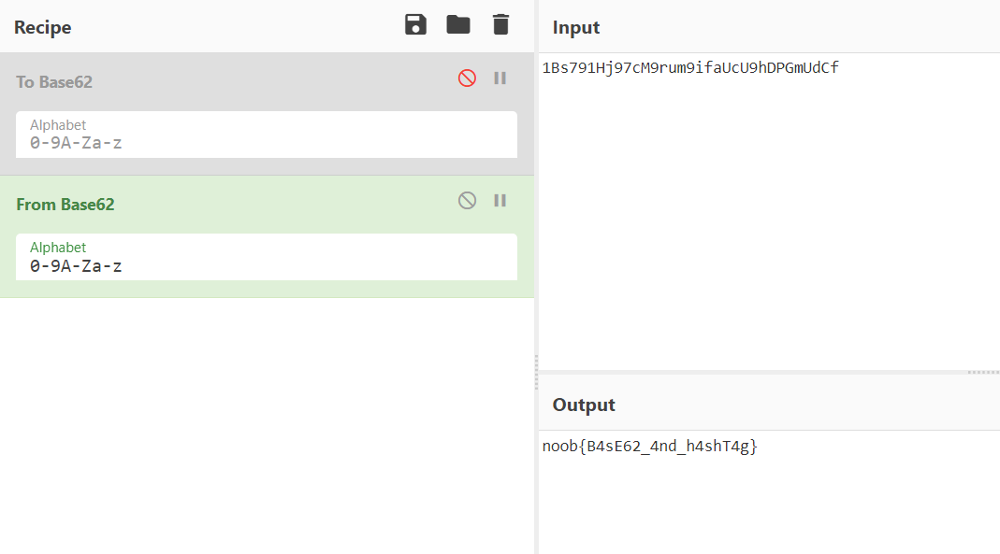

# Just For Fun

## Problem

```
#we-are-noobarmy

Author: Th3_D3v1n3r
```

## Solution

The challenge name itself refers to "hashtag" in l33t, and we are given a hashtag in the challenge description as well. This must
have something to do with the social media sites of n00b_4rmy.

Poking around on n00b_4rmy's Twitter, we find this post:


We are given what seems like a ciphertext, and a hint in the first line `"Noobs love 0x3e"`. `0x3e` is hex for 62. 
It was a challenge finding out what exactly this 62 referred to (mistook it for unicode, XOR key, etc); eventually 
it was discovered that it referred to the ciphertext being encoded in *Base62*.

So we use the handy CyberChef to decode the ciphertext, which gives us the flag.




**Flag**: `noob{B4sE62_4nd_h4shT4g}`