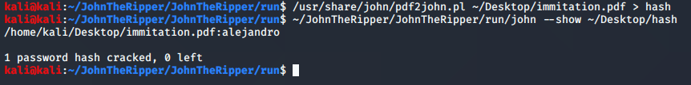
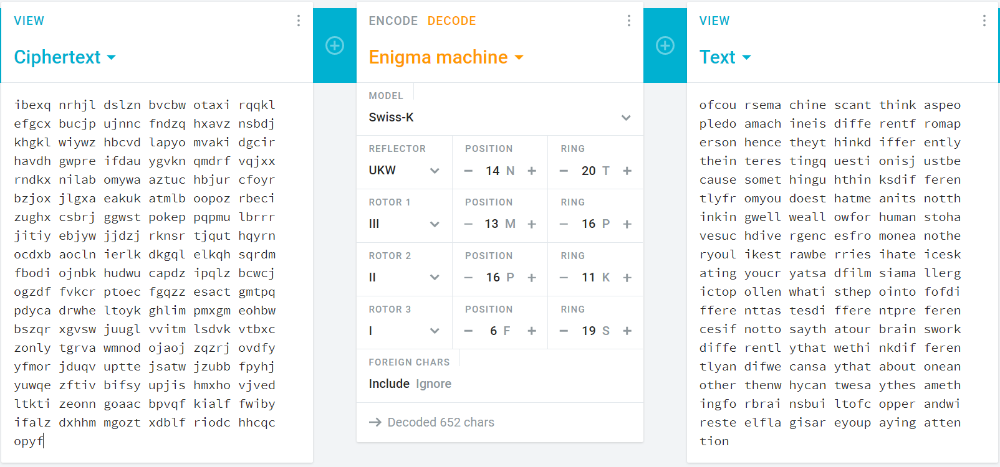

# The Imitation Game

## Problem

```
Have you watched this movie??

Points: 100
```

## Solution

We are given two files, `game.txt` and `immitation.pdf`. `game.txt` seems to be an encrypted ciphertext of some sort, 
while `immitation.pdf` is password-protected. We can try cracking this using John the Ripper:



Using the password `alejandro`, we can access the pdf. It seems like it only contains one line, but using Ctrl+A, it shows
some hidden text:


Copying all this text onto an IDE, we can see the missing text:
```
I see nothing Here.
Swiss k
UKW 14 N 20T
III 13M 16P
II 16P 11K
I 6F 19S
Ignore
```

Swiss-K refers to a variant of the Enigma, an encryption device used in WWII (and plays an important part in the movie 
bearing the challenge name).

We try using [this site](https://cryptii.com/pipes/swiss-enigma), along with the key information from the pdf, to decrypt 
the ciphertext in `game.txt`:



The last part of the plaintext reveals the flag.

**Flag**: `noob{are_you_paying_attention}`


