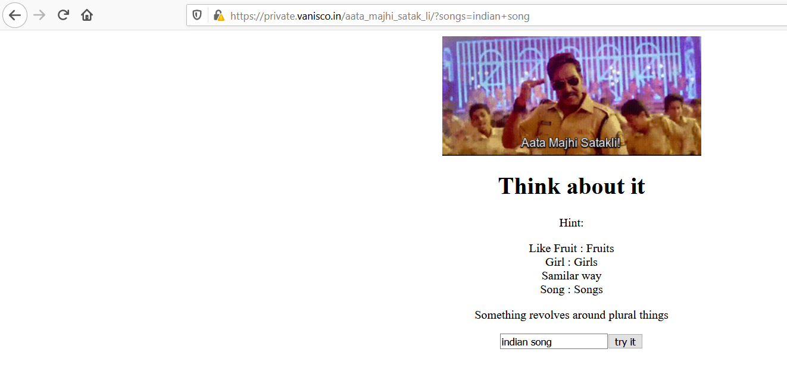
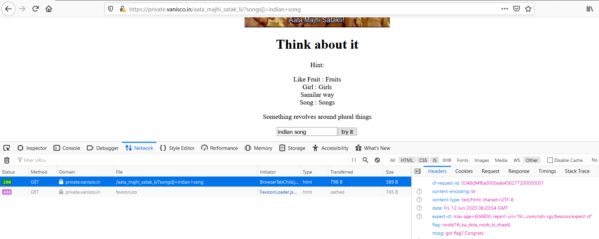

# Think About It

## Problem

```
https://private.vanisco.in/aata_majhi_satak_li/

Author: Vanisco
```

## Solution

***Note:** solved after competition end*

Accessing the page:



PHP allows URL parameters to be an array. Was a sanity check for whether a variable or array is passed. Change `songs`
URL parameter to `songs[]`, the flag will be in the response header.



**Flag**: `noob{16_ka_dola_noob_ki_chaati}`