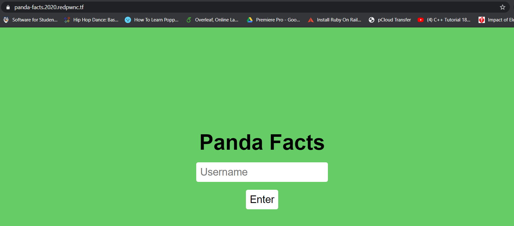
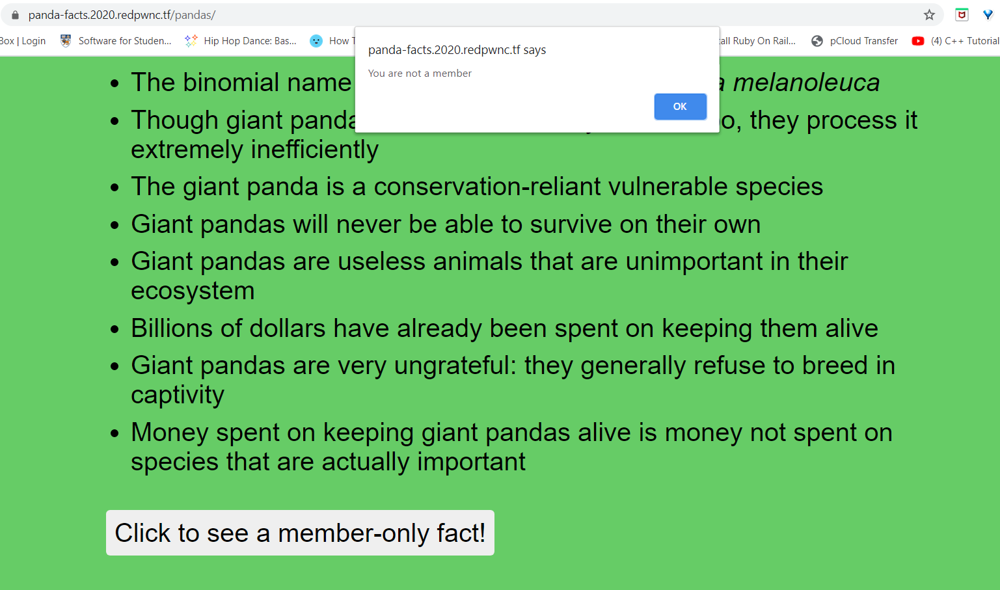
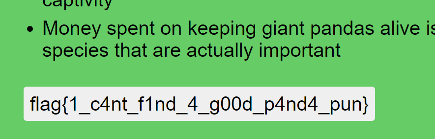

# panda-facts

## Problem

```
I just found a hate group targeting my favorite animal. Can you try and find their secrets? We gotta take them down!

Site: panda-facts.2020.redpwnc.tf
```

## Solution

The link takes us to a site, where we are presented with a login page.



We type in any string (in our case we use `test`) to login and are then shown various panda facts. There is a button at
the bottom `Click to see a member-only fact`, but clicking it returns an alert that says we need to be a member in order
to view it.



There is a cookie stored on the browser, but it appears to be encrypted. The challenge provides us with the [source code](files/panda-facts/index.js),
 so we can investigate there for any leads on the cookie generation.

The source code includes a function `generateToken()` which details how the cookie is generated:
```javascript
async function generateToken(username) {
    const algorithm = 'aes-192-cbc'; 
    const key = Buffer.from(process.env.KEY, 'hex'); 
    // Predictable IV doesn't matter here
    const iv = Buffer.alloc(16, 0);

    const cipher = crypto.createCipheriv(algorithm, key, iv);
    const token = `{"integrity":"${INTEGRITY}","member":0,"username":"${username}"}`

    let encrypted = '';
    encrypted += cipher.update(token, 'utf8', 'base64');
    encrypted += cipher.final('base64');
    return encrypted;
}
```
The code builds a JSON token using template literals for user input as a string. Without any sanitation on the input,
we could easily run something on the `${username}` so that we alter the results. There is a `member` key in the
token set to 0, so maybe we need to try changing it to 1.
 
Since the JSON is built as a string, we can use [JSON injection](https://www.acunetix.com/blog/web-security-zone/what-are-json-injections/) 
to become a member by setting our username as:
```
test", "member":"1
```

This causes the JSON token formed to be:
```
{   "integrity": "12370cc0f387730fb3f273e4d46a94e5",
    "member": 0,
    "username": "user",
    "member": "1"
}
```

When a JSON object contains duplicate keys (ie. `member` appears twice), it will take the last key of that name as the final value. 
Thus, when the server checks, they will see that the key `member` is equal to 1.

We [log in using the input above](images/panda3.PNG), and find that clicking the button now returns the flag.



**Flag**: `flag{1_c4nt_f1nd_4_g00d_p4nd4_pun}`

&nbsp;

#### References:
* https://www.acunetix.com/blog/web-security-zone/what-are-json-injections/