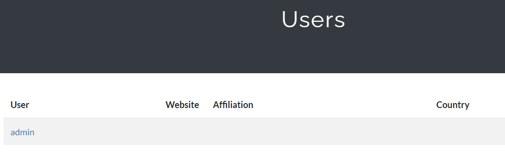
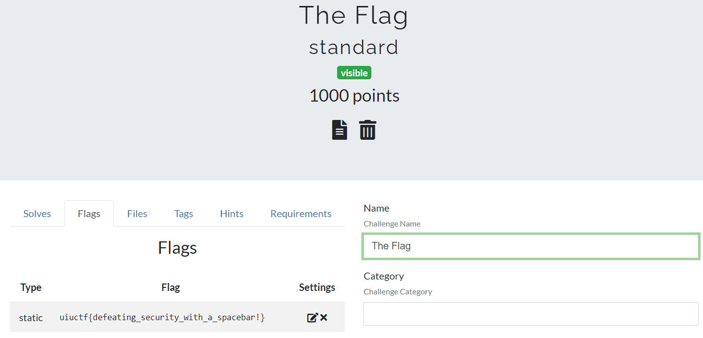

# Just a Normal CTF

## Problem

```
Do NOT use sensitive passwords on this site. You can use a fake email if you want, too.

https://ctfd.chal.uiuc.tf

Author: tow_nater
```

## Solution

The link takes us to a different CTFd platform, [Just a Normal CTF (JANC)](images/janc1.PNG). The welcome message `"very secure platform, CTFd!!"`
sets off red flags that the exploit involves a CTFd platform vulnerability. Sure enough, there is an [exploit](https://vulmon.com/vulnerabilitydetails?qid=CVE-2020-7245&scoretype=cvssv2) 
matching the JANC CTFd properties.

If we look at the users on JANC, there is a single account `admin`.



We create an account using a fake email, where our username is `admin` with [whitespaces prepended at the front](images/janc2a.PNG). This will 
cause a username collision that allows us to assume the actual `admin` username and conduct privilege escalation.

Log out, initiate a password change using `Forgot your password` button. [A bunch of popups](images/janc3.PNG) simulate the reset password email.
This means we are on the right track. We follow the link given: 
```
http://ctfd.chal.uiuc.tf/reset_password/ImFkbWluIg.XxXbHA.FpqrpZNwWFE1YmI8ItZpzMexBK4
```
and change our password to whatever we want. Now we can [log in as admin](images/janc4.PNG) directly!

Logging in now, we find that there is an [admin panel at the top](images/janc6.PNG). Accessing the challenge settings for `The Flag` challenge
allows us to obtain the flag.



**Flag**: `uiuctf{defeating_security_with_a_spacebar!}`

&nbsp;

#### References:
* https://vulmon.com/vulnerabilitydetails?qid=CVE-2020-7245&scoretype=cvssv2