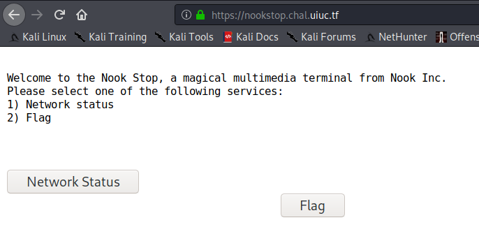
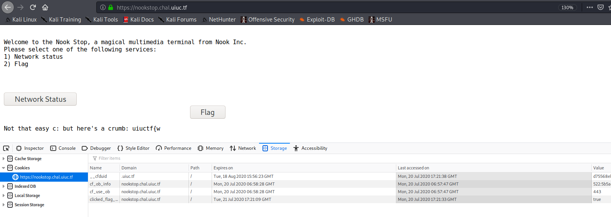

# nookstop

## Problem

```
The Nook Stop has been acting up today.....

https://nookstop.chal.uiuc.tf/

author: ian5v
```

## Solution

The link takes us to a webpage with two buttons: `Network Status` and `Flag`. `Flag` button moves everytime our cursor gets
near to it, and even if we manage to click it, it returns nothing.



Let's check out the [source code](files/nookstop/sourcecode.txt) of the page.

```javascript
$("#flag").click(function(){
    console.log("TODO: シークレット_バックエンド_サービスを可能にする");
    document.cookie = "clicked_flag_button=true";
    location.reload();
});
```

The function suggests that we should conduct cookie manipulation. But what cookie names and values are required? We try 
adding `clicked_flag_button=true` as per the second line of the function, but it only returns us a fragment of the flag.



We look at the `console.log` function, which contains a TODO task in some Japanese. Translating the Japanese gives us 
`TODO: Enable Secret_Backend_Service`. Slightly guessy, but this was a clue for us to add the cookie `secret_backend_service=true`.

As per the challenge author, [the cookie is all letters lowercase](images/nookstop3.PNG).

We try submitting a request again, and the whole flag is returned.


**Flag**: `uiuctf{wait_its_all_cookies?}`


