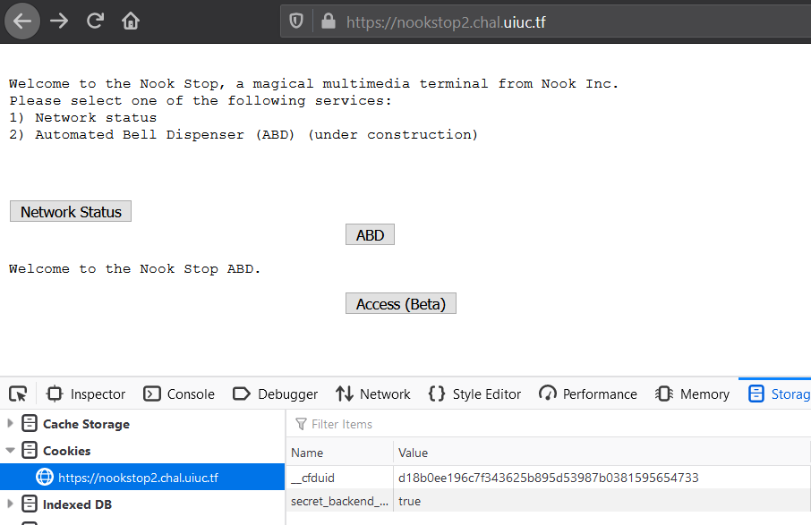
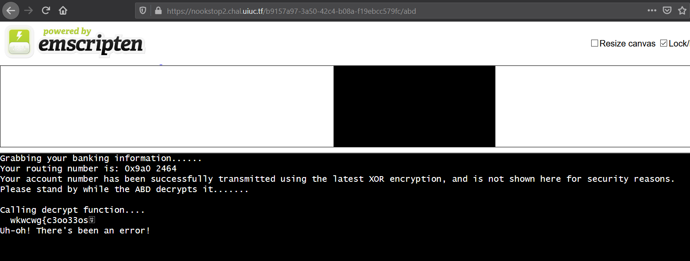

# nookstop 2.0

## Problem

```
Okay okay, they got back to me and they tell me that we're using some new technology. Can you give it a try now?

https://nookstop2.chal.uiuc.tf/

author: ian5v
```

## Solution

***Note**: solved after competition end*

Accessing this link, we are taken to a [webpage](images/nookstop2_1.PNG) which is almost the exact same as nookstop 1.0. 
There is a hint at the bottom of the page telling us to do whatever we did for nookstop 1.0 to advance.

As such, we add the `secret_backend_service=true` cookie to the webpage, and this reveals a previously hidden button.



Clicking on the button takes us to an emscripten page. 



We look at the terminal output:
```
Grabbing your banking information......
Your routing number is: 0x9a0 2464
Your account number has been successfully transmitted using the latest XOR encryption, and is not shown here for security reasons.
Please stand by while the ABD decrypts it.......

Calling decrypt function....
  wkwcwg{c3oo33os<byte 0x7f>
Uh-oh! There's been an error!
```

The beginning of the encryption `wkwcwg{` resembles that of the beginning part of the flag `uiuctf{`. We XOR both these
substrings to find out how big the difference is between individual characters.
```python
>>> os = "wkwcwg{c3oo33os\x7f"
>>> bs = "uiuctf{"
>>> print( [ord(os[i])^ord(bs[i]) for i in range(len(bs))] )
[2, 2, 2, 0, 3, 1, 0]
```
This shows that the XOR difference between characters is between 0 to 3 - aka the 2 LSBs are different. We write a script 
that outputs each letter in the encryption XORed with 0, 1, 2 and 3. Each row represents the possible decrypted letter.
```python
>>> for b in os:
...  print( chr(ord(b) ^ 0) + chr(ord(b) ^ 1) + chr(ord(b) ^ 2) + chr(ord(b) ^ 3) )
... 
wvut
kjih
wvut
cba`
wvut
gfed
{zyx
cba`    <-- Start of flag content
3210
onml
onml
3210
3210
onml
srqp    <-- End of flag content
~}|
```
The first 7 rows refer to `uiuctf{`, and the last is the ending `}`, so we need to guess the remaining 8 letters in between. We figure that 
it will be English leetspeak, so take the letter options, and convert the numbers 3210 into the letters `eszilo`. Then search 
for an answer in a regex-based dictionary. 

We can use Nutrimatic which ranks by frequency as an English word, and the [results](https://nutrimatic.org/?q=%5Babc%5D%5Beszilo%5D%5Bomnl%5D%5Bomnl%5D%5Beszilo%5D%5Beszilo%5D%5Bomnl%5D%5Bsrqp%5D&go=Go) 
give one big answer: “billions”. Convert this back to leetspeak to get the flag.


**Flag**: `uiuctf{b1ll10ns}`

&nbsp;

#### References:
* https://nutrimatic.org/

