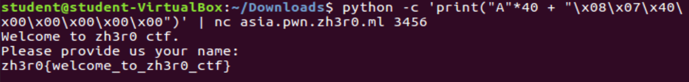

# Free Flag

## Problem

```
Welcome to zh3r0 ctf
Here's your free flag

asia.pwn.zh3r0.ml 3456
europe.pwn.zh3r0.ml 3456
us.pwn.zh3r0.ml 3456

Author : hk
```

## Solution

Running the [executable](files/freeflag/chall) `./chall`, we flood the input with A characters to check if buffer overflow is viable. It segfaults, 
thus meaning buffer overflow (BOF) can be done. 

We run executable `chall` in gdb mode. First we do `checksec` to check the protections enabled:


Minimal protection suggests we can do a simple buffer overflow attack. Then, we dump the assembly code from the 
executable to check for anything of interest, using command `objdump -d chall > challbin.asm` (assembly code [here](files/freeflag/challbin.asm)):


Notice the interesting function `win_win`. It perhaps seems to make a `cat` syscall. Maybe we should try BOFing to this 
function address.

Checking the assembly/trial and error tells us the buffer size is 40. We pad the address of `win_win` with 40 As, and
pipe this to the `chall` executable.


Perfect! This exploit works locally, now we just need to replay this on the server. However, when we tried the exact 
same thing on the remote server, it returns an error. There is no PIE enabled, so why wouldn't the exact same address work?

After talking with one of my other friends, we found out that the address had to be adjusted from `0x400707` to `0x400708`.
(note: challenge author explained that this was due to need for stack alignment). We edit the return address and try once
again:



Alternatively, we can create a [script](files/freeflag/exploit1.py) that connects remotely to the server and feeds the input:


**Flag**: `zh3r0{welcome_to_zh3r0_ctf}`