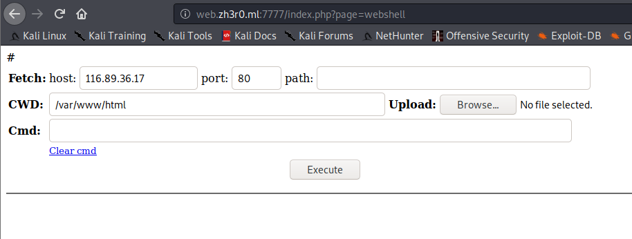

# Google Source Code

## Problem

```
you dont get anything free except the source code. Try to search it and also I never liked to upload my homework in google classroom. Help me hack this website please :)

Author : Finch
```

## Solution

Accessing the link brings us to this page:


The "Classroom" and "Your Work" buttons lead to dead ends. We check the page source code for any leads, and it contains
this comment:
 


This was a (rather guessy) LFI; the source code comment suggesting `?page=` parameter should be added to the URL. After
some trial and error, we found adding `?page=upload` takes us to a file upload page:


We upload a PHP webshell file obtained from [here](https://github.com/WhiteWinterWolf/wwwolf-php-webshell). After which,
we access this webshell by changing `page` parameter. Now we access webshell page at `web.zh3r0.ml:7777/index.php?page=webshell`:



Using `ls -laR` shows there are many fake `flag.php` files. We use `grep` command to search for the flag using the webshell
in the current directory.


**Flag**: `zh3r0{h3y_d1d_y0u_upl04d_c0rr3ct1y???_84651320}`