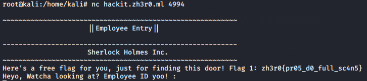
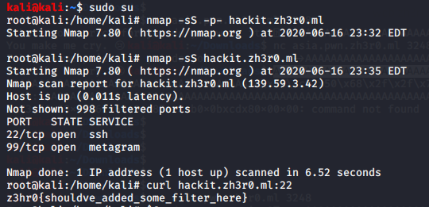
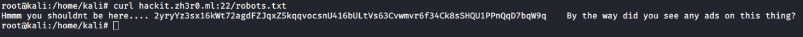
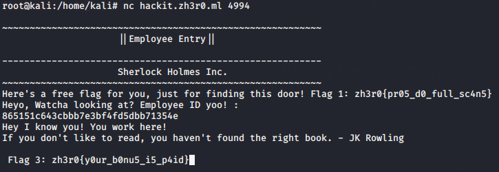
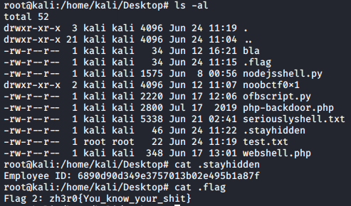
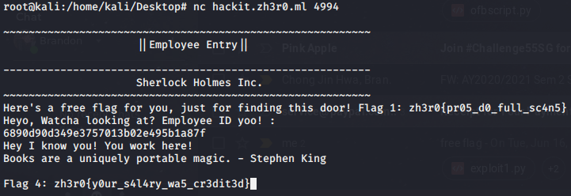
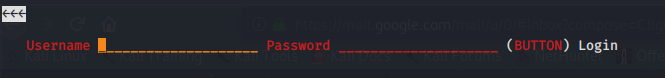
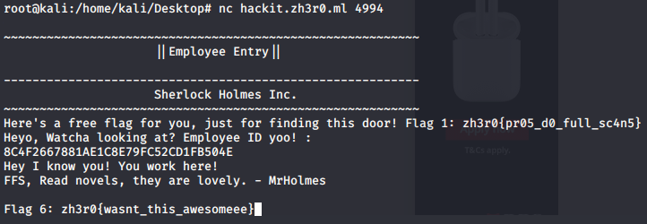

# Subset of Subset of Hacking Machines

This set of challenges was given it's own category, involving enumeration of ports using automated scanners followed by 
web-based attacks.

## Problem

```
Description: Here's the url ;)

   hackit.zh3r0.ml

Author : Mr.Holmes
```

## Solution

***Note**: use of `nmap` and other scanners was permitted by the challenge author.*

***Note 2**: Flags are arranged in logical order (ie the likely intended order of solving)* <1,5,3,2,4,6,7>

### Prelude 
Accessing the link in http doesn't return us any page. We run nmap scanner on the given web link `hackit.zh3r0.ml`, 
using command `nmap -p- -T4 hackit.zh3r0.ml`. The result output is as follows:

```bash
Not shown: 65529 closed ports
PORT      STATE SERVICE
22/tcp    open  ssh
99/tcp    open  metagram
324/tcp   open  rpki-rtr-tls
3306/tcp  open  mysql
4994/tcp  open  unknown
42955/tcp open  unknown
```

### Flag 1

We try connecting to port 4994 via `nc` command. This leads us to a running employee login service of some sort. The
flag is available on startup. This login service will be important for subsequent flags.



**Flag 1**: `zh3r0{pr05_d0_full_sc4n5}`

### Flag 5

We try sending a curl to port 22 via `hackit.zh3r0.ml:22` and the response contains the flag.



**Flag 5**: `zh3r0{shouldve_added_some_filter_here}`

### Flag 3

Mr. Holmes gave us a prompt that there was more than one flag on port 22. I went back to search for more leads, and 
decided to check `robots.txt` *(NTS: a must-do for any web service challenge in future)* by sending a curl request. This
returned some interesting information:



We look at the first part of the text dump:
```
Hmm you shouldnt be here.... 2yryYz3sx16kWt72agdFZJqxZ5kqqvocsnU416bULtVs63Cvwmvr6f34Ck8sSHQU1PPnQqD7bqW9q
```

My first thought was to run this cipher through CyberChef, to see if it could be decoded. [Using Magic mode](images/flag3_2.PNG) reveals 
the cipher was Base58 encoded, and revealed this message:

```
I tried to hide this, anyway, check out /clue3349203.txt
```

So we try [searching for this file on port 22](images/flag3_3.PNG), which returns a whole bunch of JSFuck code. [Decrypting
this](images/flag3_4.PNG) using an online JSFuck decryptor, it returns us a console.log statement containing an Employee ID. We paste the employee 
ID into the login service on port 4994, giving us the flag:



**Flag 3**: `zh3r0{y0ur_b0nu5_i5_p4id}`

***Note**: Challenges below solved after competition end.*

### Flag 2

Connect to port 324 using `ftp`. In passive mode, we traverse the FTP server and discover two files of interest 
`.stayhidden` and `.flag`. Using `get` command in FTP, we can download these 2 files to our local machine.
Command line transaction can be found [here](files/hackingmachines/flag2_commandoutput.sh).

In our local machine, use `cat` on `.flag` to get the flag.



**Flag 2**: `zh3r0{You_know_your_shit}`

### Flag 4

From port 324, we obtained a file `.stayhidden`. Running `cat` on this file gives us an Employee ID (as seen above).
Connect to the employee login service at port 4994 and input this ID to get the flag.



**Flag 4**: `zh3r0{y0ur_s4l4ry_wa5_cr3dit3d}`

### Flag 6

Recall earlier, at port 22, the `robots.txt` returned a bunch of text? Now we look at the second part of the text which
was previously ignored.


```
By the way, did you see any ads on this thing?
```
This was a prompt to check `ads.txt` on port 22. Doing so gives us some ciphertext again. Running it through CyberChef reveals
it is Base62 encoded this time, telling us to check `/index2.html`. Doing so on a browser like Firefox [would return an unsafe port error](images/flag6_2.PNG),
as Firefox thinks it is only designated for SSH protocols and not HTTP.

We instead use `lynx`, a CLI-based web browser, to [work around this](images/flag6_3.PNG). Accessing `/index2.html` brings us to a login page. 



We try [basic SQL injection](images/flag6_5.PNG) to bypass, and it works, giving us a [chunk of ciphertext](files/hackingmachines/flag6_data.txt).

The challenge description for this flag gave us a hint:
```
P.S. Ninja is really educated on how to secure his website, he even reads about many greek demi-gods(?)
```

This means that the cipher used shares the name of a demi-god. A quick google search reveals the cipher is Pollux cipher.
We use an online Pollux cipher decoder to [decode the ciphertext](images/flag6_6.PNG) and it returns us another Employee ID.

We submit this Employee ID on the employee login service at port 4994, returning us the flag.



**Flag 6**: `zh3r0{wasnt_this_awesomeee}`

### Flag 7

Given that we know `hackit.zh3r0.ml:22/index2.html` is vulnerable to SQL injection, we try running `sqlmap` on the page.

[Video walkthrough can be found here](https://youtu.be/8o1NzqQr7Jc). Credits to Mr Holmes for his official writeup pointers.

**Flag 7**: `zh3r0{Dangit_you_are_good!}`

&nbsp;
---

**NTS:** note from Mr.Holmes (challenge author): 

* `nmap` command used:
```
nmap -sC -sV <target IP> -p- -T5 --min-rate 2500 -oN inital_scan
```

* > As I said many times, you/everyone needed to do ***multiple nmaps to get exact overview*** of (the open ports)
>
Not all ports would show in a single scan. Doing ***multiple scans*** would have cleared you out of false positives


