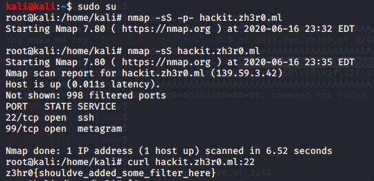

# Flag 5

## Problem

```
Description: Here's the url ;)

   hackit.zh3r0.ml

Author : Mr.Holmes
```

## Solution

***Note**: use of nmap and other scanners was permitted by the challenge author.*

We run nmap scanner on the given web link `hackit.zh3r0.ml`, which shows us 2 open ports: 22 and 99.

We try sending a GET request to `hackit.zh3r0.ml:22` and the response is the flag.



**Flag**: `zh3r0{shouldve_added_some_filter_here}`

&nbsp;
---

**NTS:** note from Mr.Holmes (challenge author): 

* `nmap` command used:
```
nmap -sC -sV IP -p- -T5 --min-rate 2500 -oN inital_scan
```

* > As I said many times, you/everyone needed to do ***multiple nmaps to get exact overview*** of (the open ports)
>
Not all ports would show in a single scan. Doing ***multiple scans*** would have cleared you out of false positives


